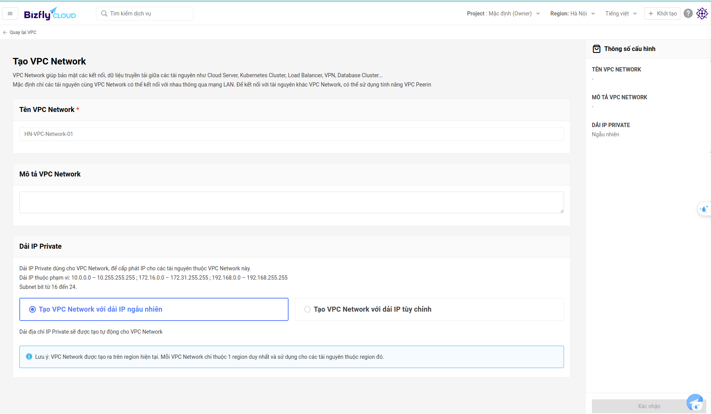

# Báo cáo tiến độ DBaaS Patroni 09/08/2024

# I. Postgresql Streaming Replication
### Ref:
[High-Performance Programming](https://www.youtube.com/watch?v=qpxKlH7DBjU&list=PLBrWqg4Ny6vVwwrxjgEtJgdreMVbWkBz0&index=2)


### Steaming Repication


### Asynchoronous Replication

Mặc định streaming replication là Asynchronous (Đồng bộ)

Primary server sẽ không chờ xác nhận những thay đổi đã được áp dụng cho standby. Nó response cho client ngay khi hoàn thành quá trình xử lý trên môi primary server

Vâỵ nên response time không khác gì không sử dụng replication (Ưu điểm)

Nhưng data trên replica có thể không fresh, và data có thể bị mất khi failover xảy ra

Asynchoronous Replication phù hợp cho việc 

- Disaster Recovery (DR) sang 1 cluster ở 1 data center khác
- Migration, data loading trong reporting systems


### Synchoronous Replication

Primary chờ phản hồi của Replica trước khi hoàn thành quá trình xử lý

Vậy nên overall response time sẽ tăng lên (Nhược điểm) vì cần thời gian vận chuyển log 

Ưu điểm:
- Phù hợp cho failover
- data read on replica sẽ là fresh

### Thử  nghiệm

#### Config primary

Sử dụng initdb để tạo Db cluster, sẽ tạo ra: 
- db directories
- system tables
- default db "postgres"

```
initdb -D /tmp/primary_db/
nano -D /tmp/primary_db/postgresql.conf
```

```
listen_address = '*' # listen to any connection
port = 5433 
```

```
pg_ctl -D /tmp/primary_db start
```

```
psql --port=5433 postgres

create user repuser replication; # chú ý cần có flag replication 
```

Quản lý ai được truy cập và cho phép những IP nào

HostBased Authentication (pg_hba.conf)
```
nano -D /tmp/primary_db/pg_hba.conf
```

thêm 1 dòng

```
type: host,
database: all,
user: repuser,
address: replica_ip
method: trust
```

```
pg_ctl -D /tmp/primary_db restart
```

#### Config repica

Chạy trên primary pg base backup

```
pg_basebackup -h localhost -U repuer --checkpoint=fase \
-D /tmp/replica_db/ -R --slot=some_name -C --port=5433
```

Sau đó, toàn bộ thư mục hiện tại trên primary sẽ được copy phù hợp sang replica

Trên replica, kiểm tra lại:

```
cd /tmp/replica_db
ls -l
```

Qúa trình copy đã điều chỉnh một chút file postgresql.auto.conf

```
cat postgresql.auto.conf
```

Thay đổi port trên replica (nếu cần, vì sau khi copy sẽ trùng port với primary)

```
pg_ctl -D /tmp/replica_db start
```

#### Monitor 

```
# Trên primary
select * from pg_stat_replicationo;
```

```
# Trên replica
select * from pg_wal_receiver;
```

Thử tạo bảng và insert trên primary và kiểm tra lại trên replica


## CAP Theorem

1. Partition Tolenrance

Một trong những instance bị lỗi, thì hệ thống vẫn sống

2. Consistence

Query tới bất kỳ node nào đều trả về nhiều nhất trạng thái hiện tại của data

3. Availability

Bất kỳ kết nối tới node nào cũng khả dụng

Trong các hệ thống phân tán chỉ có thể thực hiện được 2/3 yêu cầu trên.

### Use case CP:

Ngân hàng cần thực hiện chuyển tiền, vì vậy cần Consitency

Các lần giao dịch chuyển tiền sẽ được thực hiện với transaction

Vì thực hiện CP nên sẽ có lúc không Availability - nhưng bussiness requirement cho phép điều này (Khách hàng chấp nhận sẽ có lúc bảo trì để restore dữ liệu từ backup)

### Use case AP:

Instagram có:
- high-volume
- consistency is desired but not critical
- Yêu cầu nghiệp vụ không cho phép có lúc ko available (người dùng sẽ bỏ đi)


# II. High-availability PostgreSQL Cluster with Patroni

Patroni dùng để tạo giải pháp tính HA PostgreSQL sử dụng sự kết hợp của PostgreSQL streaming replication và consensus-based configuration store (kho cấu hình dựa trên sự đồng thuận) như etcd, ZooKeeper, or Consul

Cấu hình mặc định thì PostgreSQL không có tính năng dành cho high availability


Trong kiến trúc này, sẽ luôn có 1 `leader`, và những node còn lại sẽ là `replicas`. Khi leader down, một trong những replicas sẽ được chọn trở thành leader mới với sự giúp đỡ từ `etcd`

## Components

### 1. PostgreSQL
PostgreSQL is the most widely used database management system in the world

### 2. Patroni

Cung cấp một mẫu để định cấu hình cụm PostgreSQL có tính sẵn sàng cao

Patroni cũng có thể xử lý các cấu hình để replication, sao lưu và khôi phục cơ sở dữ liệu.

Cài đặt của Patroni được quản lý thông qua việc sử dụng tệp YAML, tệp này có thể được lưu trữ ở bất kỳ vị trí nào. Thường lưu các cấu hình trong tệp /etc/patroni.yml.

### 3. ETCD
Etcd lưu trữ trạng thái của cụm PostgreSQL. Khi tìm thấy bất kỳ thay đổi nào về trạng thái của bất kỳ nút PostgreSQL nào, Patroni sẽ cập nhật thay đổi trạng thái trong kho lưu trữ key-value ETCD. ETCD sử dụng thông tin này để chọn primary và duy trì hoạt động của cụm.

### 4. HAProxy

HAProxy là phần mềm mã nguồn mở miễn phí, cung cấp bộ cân bằng tải và máy chủ proxy có tính khả dụng cao cho các ứng dụng dựa trên TCP và HTTP nhằm phân tán yêu cầu trên nhiều máy chủ. 

HAProxy theo dõi các thay đổi trong node master và node slave và kết nối với nút master thích hợp khi client yêu cầu kết nối.


## Cách thức hoạt động
Một <b>Patroni</b> bot được install trong mỗi node Postgresql trong cụm. 

Quá trình chọn ra leader liên quan đến việc tạo cố gắng set expired key trong Etcd. Database primary được chọn là node set được Etcd key đầu tiên. 

Sau khi xác định được có node sở hưu khóa, Patroni bot sẽ cầu hình instance postgresql đó hoạt động như database `primary`.

Việc lựa chọn leader cũng được hiển thị cho các node còn lại, và Patroni của các bot còn lại sẽ cấu hình instances thành `replica`

<b>HAProxy</b> giám sát các thay đổi trong node master/slave và kết nối với nút master thích hợp khi máy client cầu kết nối. HAProxy xác định nút nào là nút master bằng cách gọi API REST của Patroni. API REST của Patroni được định cấu hình để chạy trên cổng 8008 trong mỗi nút cơ sở dữ liệu.

Role: Master


Role: Replica


Kiến trúc này được thiết kế để cung cấp một cụm cơ sở dữ liệu mạnh mẽ, tự quản lý, trong đó tính sẵn sàng cao là mối quan tâm hàng đầu. Bằng cách sử dụng đồng thời Patroni, etcd và HAProxy, quá trình thiết lập sẽ tự động chuyển đổi dự phòng, cân bằng tải hiệu quả và sao chép nhất quán, từ đó mang lại một môi trường cơ sở dữ liệu linh hoạt và hiệu suất cao.

Quá trình hồi phục failover không phải luôn được thực hiện ngay llaapj tức, còn tùy thuộc vào trạng thái của cụm và tùy vào lý do xảy ra failover. Có thể có 1 khoảng thời gian ngắn unavailablity khi một leader mới đang được chọn vầ cụm đang được config lại

# 2. Setup Postgres HA Patroni
## Architecture


Machine: node1                   IP: 192.168.144.133                 Role: Postgresql, Patroni

Machine: node2                   IP: 192.168.144.135                Role: Postgresql, Patroni

Machine: node3                   IP: 192.168.144.136                 Role: Postgresql, Patroni

Machine: etcdnode              IP: 192.168.144.129           Role: etcd

Machine: haproxynode       IP: 192.168.144.132    Role: HA Proxy

## Step 1 –  Setup node1, node2, node3:

### Node1, Node2, Node3
```
sudo apt update

sudo hostnamectl set-hostname nodeN # chú ý thay N = 1,2,3

sudo apt install net-tools

sudo apt install postgresql postgresql-server-dev-12

sudo systemctl stop postgresql

sudo ln -s /usr/lib/postgresql/12/bin/* /usr/sbin/

sudo apt -y install python python3-pip

sudo apt install python3-testresources   

sudo pip3 install --upgrade setuptools 
 
sudo pip3 install psycopg2

sudo pip3 install patroni

sudo pip3 install python-etcd
```

## Step 2 –  Setup etcdnode:

```
sudo apt update

sudo hostnamectl set-hostname etcdnode

sudo apt install net-tools

sudo apt -y install etcd 
```

## Step 3 – Setup haproxynode:
```
sudo apt update

sudo hostnamectl set-hostname haproxynode

sudo apt install net-tools

sudo apt -y install haproxy
```

## Step 4 – Configure etcd on the etcdnode: 
```
sudo vi /etc/default/etcd   
```

Sửa file cấu hình etcd
```
ETCD_LISTEN_PEER_URLS="http://192.168.144.129:2380"
ETCD_LISTEN_CLIENT_URLS="http://localhost:2379,http://192.168.144.129:2379"
ETCD_INITIAL_ADVERTISE_PEER_URLS="http://192.168.144.129:2380"
ETCD_INITIAL_CLUSTER="default=http://192.168.144.129:2380,"
ETCD_ADVERTISE_CLIENT_URLS="http://192.168.144.129:2379"
ETCD_INITIAL_CLUSTER_TOKEN="etcd-cluster"
ETCD_INITIAL_CLUSTER_STATE="new"
```


```
sudo systemctl restart etcd 

sudo systemctl status etcd
```

Xem danh sách member

curl http://192.168.144.129:2380/members


## Step 5 – Configure Patroni on the node1, on the node2 and on the node3:
```
sudo vi /etc/patroni.yml
```

### Node 1
```
scope: postgres
namespace: /db/
name: node1

restapi:
    listen: 192.168.144.133:8008
    connect_address: 192.168.144.133:8008

etcd:
    host: 192.168.144.129:2379

bootstrap:
  dcs:
    ttl: 30
    loop_wait: 10
    retry_timeout: 10
    maximum_lag_on_failover: 1048576
    postgresql:
      use_pg_rewind: true
      use_slots: true
      parameters:

  initdb:
  - encoding: UTF8
  - data-checksums

  pg_hba:
  - host replication replicator 127.0.0.1/32 md5
  - host replication replicator 192.168.144.133/0 md5
  - host replication replicator 192.168.144.135/0 md5
  - host replication replicator 192.168.144.136/0 md5
  - host all all 0.0.0.0/0 md5

  users:
    admin:
      password: admin
      options:
        - createrole
        - createdb

postgresql:
  listen: 192.168.144.133:5432
  connect_address: 192.168.144.133:5432
  data_dir: /data/patroni
  pgpass: /tmp/pgpass
  authentication:
    replication:
      username: replicator
      password: Vinh1507
    superuser:
      username: postgres
      password: Vinh1507
  parameters:
      unix_socket_directories: '.'

tags:
    nofailover: false
    noloadbalance: false
    clonefrom: false
    nosync: false
```

### Node 2

```
scope: postgres
namespace: /db/
name: node2

restapi:
    listen: 192.168.144.135:8008
    connect_address: 192.168.144.135:8008

etcd:
    host: 192.168.144.129:2379

bootstrap:
  dcs:
    ttl: 30
    loop_wait: 10
    retry_timeout: 10
    maximum_lag_on_failover: 1048576
    postgresql:
      use_pg_rewind: true
      use_slots: true
      parameters:

  initdb:
  - encoding: UTF8
  - data-checksums

  pg_hba:
  - host replication replicator 127.0.0.1/32 md5
  - host replication replicator 192.168.144.133/0 md5
  - host replication replicator 192.168.144.135/0 md5
  - host replication replicator 192.168.144.136/0 md5
  - host all all 0.0.0.0/0 md5

  users:
    admin:
      password: admin
      options:
        - createrole
        - createdb

postgresql:
  listen: 192.168.144.135:5432
  connect_address: 192.168.144.135:5432
  data_dir: /data/patroni
  pgpass: /tmp/pgpass
  authentication:
    replication:
      username: replicator
      password: Vinh1507
    superuser:
      username: postgres
      password: Vinh1507
  parameters:
      unix_socket_directories: '.'

tags:
    nofailover: false
    noloadbalance: false
    clonefrom: false
    nosync: false
```


### Node 3

```
scope: postgres
namespace: /db/
name: node3

restapi:
    listen: 192.168.144.136:8008
    connect_address: 192.168.144.136:8008

etcd:
    host: 192.168.144.129:2379

bootstrap:
  dcs:
    ttl: 30
    loop_wait: 10
    retry_timeout: 10
    maximum_lag_on_failover: 1048576
    postgresql:
      use_pg_rewind: true
      use_slots: true
      parameters:

  initdb:
  - encoding: UTF8
  - data-checksums

  pg_hba:
  - host replication replicator 127.0.0.1/32 md5
  - host replication replicator 192.168.144.133/0 md5
  - host replication replicator 192.168.144.135/0 md5
  - host replication replicator 192.168.144.136/0 md5
  - host all all 0.0.0.0/0 md5

  users:
    admin:
      password: admin
      options:
        - createrole
        - createdb

postgresql:
  listen: 192.168.144.136:5432
  connect_address: 192.168.144.136:5432
  data_dir: /data/patroni
  pgpass: /tmp/pgpass
  authentication:
    replication:
      username: replicator
      password: Vinh1507
    superuser:
      username: postgres
      password: Vinh1507
  parameters:
      unix_socket_directories: '.'

tags:
    nofailover: false
    noloadbalance: false
    clonefrom: false
    nosync: false
```

Tại mỗi node, cấu hình patroni service

```
sudo mkdir -p /data/patroni
```
```
sudo chown postgres:postgres /data/patroni
```
```
sudo chmod 700 /data/patroni 
```
```
sudo vi /etc/systemd/system/patroni.service
```
```
[Unit]
Description=High availability PostgreSQL Cluster
After=syslog.target network.target

[Service]
Type=simple
User=postgres
Group=postgres
ExecStart=/usr/local/bin/patroni /etc/patroni.yml
KillMode=process
TimeoutSec=30
Restart=no

[Install]
WantedBy=multi-user.targ
```

## Step 6 – Start Patroni service on the node1, on the node2 and on the node3:
```
sudo systemctl start patroni

sudo systemctl status patroni
```

## Step 7 – Configuring HA Proxy on the node haproxynode: 

```
sudo vi /etc/haproxy/haproxy.cfg
```

Replace its context with this:

```
global
        log /dev/log    local0
        log /dev/log    local1 notice
        chroot /var/lib/haproxy
        stats socket /run/haproxy/admin.sock mode 660 level admin expose-fd listeners
        stats timeout 30s
        user haproxy
        group haproxy
        daemon

        # Default SSL material locations
        ca-base /etc/ssl/certs
        crt-base /etc/ssl/private

        # See: https://ssl-config.mozilla.org/#server=haproxy&server-version=2.0.3&config=intermediate
        ssl-default-bind-ciphers ECDHE-ECDSA-AES128-GCM-SHA256:ECDHE-RSA-AES128-GCM-SHA256:ECDHE-ECDSA-AES25>
        ssl-default-bind-ciphersuites TLS_AES_128_GCM_SHA256:TLS_AES_256_GCM_SHA384:TLS_CHACHA20_POLY1305_SH>
        ssl-default-bind-options ssl-min-ver TLSv1.2 no-tls-tickets


defaults
        log     global
        mode    http
        option  httplog
        option  dontlognull
        timeout connect 5000
        timeout client  50000
        timeout server  50000
        errorfile 400 /etc/haproxy/errors/400.http
        errorfile 403 /etc/haproxy/errors/403.http
        errorfile 408 /etc/haproxy/errors/408.http
        errorfile 500 /etc/haproxy/errors/500.http
        errorfile 502 /etc/haproxy/errors/502.http
        errorfile 503 /etc/haproxy/errors/503.http
        errorfile 504 /etc/haproxy/errors/504.http


frontend stats
   bind *:8404
   option http-use-htx
   http-request use-service prometheus-exporter if { path /metrics }
   stats enable
   stats uri /stats
   stats refresh 10s


listen postgres
    bind *:5000
    mode tcp
    option httpchk
    http-check expect status 200
    default-server inter 3s fall 3 rise 2 on-marked-down shutdown-sessions
    server node1 192.168.144.133:5432 maxconn 100 check port 8008
    server node2 192.168.144.135:5432 maxconn 100 check port 8008
    server node3 192.168.144.136:5432 maxconn 100 check port 8008
```
```
sudo systemctl restart haproxy

sudo systemctl status haproxy
```


Truy cập http://192.168.144.132:8404/stats


Chạy trên 1 node bất kỳ
```
patronictl -c /etc/patroni.yml list
```


### Kết nối tới Database thông qua Ha proxy

Bị lỗi: Error connecting to server : received invalid response to SSL negotiation

[Stackoverflow](https://stackoverflow.com/questions/28313848/error-connecting-to-server-received-invalid-response-to-ssl-negotiation)

Chú ý phải sửa lại /etc/haproxy/haproxy.cfg để mở kết nối dạng TCP
```
listen postgres
    bind *:5000
    mode tcp
    option httpchk
    http-check expect status 200
    default-server inter 3s fall 3 rise 2 on-marked-down shutdown-sessions
    server node1 192.168.144.133:5432 maxconn 100 check port 8008
    server node2 192.168.144.135:5432 maxconn 100 check port 8008
    server node3 192.168.144.136:5432 maxconn 100 check port 8008
```

pgAdmin4


Hoặc sử dụng psql:
```
psql -h 192.168.144.132 -p 5000 -U postgres
```

## Thử nghiệm replica:

### Kịch bản:
- Truy cập vào 3 database trên 3 node
- Tại node1 (primary) tạo mới 1 table `employees`
- Thêm vào bảng trên 2 bản ghi
- Kiểm tra 2 node còn lại với câu lệnh `\dt`
```
CREATE TABLE employees (
    id SERIAL PRIMARY KEY,
    name VARCHAR(100),
    position VARCHAR(50),
    salary NUMERIC(15, 2)
);
INSERT INTO employees (name, position, salary) VALUES
('Bui Hoang Vinh', 'Software Engineer', 75000.00),
('Pham Van Toi', 'Database Administrator', 80000.00);
SELECT * FROM employees;
```

```
INSERT INTO employees (name, position, salary) VALUES
('Nguyen Duc Anh', 'Software Engineer', 95000.00);
SELECT * FROM employees;
```
### Kết quả

Khi hoàn thành tạo bảng


Sau khi insert 2 bản ghi

Tất cả các node đã có dữ liệu


Nếu thực hiện insert trên replica sẽ không được phép thực hiện (read-only transaction)


### Nhận xét:
Đã thực hiện replica 


## Thử nghiệm failover

Hiện tại, node1 đang là primary, thực hiện stop patroni trên node1
```
sudo systemctl stop patroni
```


Kết quả: Node3 được trở thành primary thay thế cho Node1

Thực hiện thêm 1 bản ghi khi node1 chưa trở lại


Khi node 1 đang down thì không thể access vào được


Cho node1 quay trở lại
```
sudo systemctl start patroni
```


Node1 vẫn được replica đầy đủ như các node khác


## Thử nghiệm tất cả các node đều down, sau đó 1 node quay trở lại

Kết quả:
- Khi có một node quay trở lại, node đó sẽ được trở thành leader của cụm

## References:

[High-availability (HA) PostgreSQL Cluster with Patroni - Medium](https://medium.com/@chriskevin_80184/high-availability-ha-postgresql-cluster-with-patroni-1af7a528c6be)

[Setup Patroni - jfrog](https://jfrog.com/community/devops/highly-available-postgresql-cluster-using-patroni-and-haproxy/)


# III. Luồng người dùng tạo DBaaS Patroni

## Ref
[Bizfly - Kết nối Postgres Patroni để giảm thiểu rủi ro](https://docs.bizflycloud.vn/cloud_database/howtos/connect_patroni_postgres/)

## Cần tạo 1 VPC Network, và cấu hình IP cho VPC Network đó
VPC (Virtual Private Cloud) là một dịch vụ cho phép tạo ra một mạng ảo riêng trong một môi trường đám mây như AWS, Azure, hay Google Cloud, .... VPC cung cấp khả năng kiểm soát hoàn toàn các tài nguyên mạng ảo, bao gồm việc chọn địa chỉ IP, cấu hình subnets, định tuyến, và thiết lập các chính sách bảo mật.

Kết hợp VPC (Virtual Private Cloud) với DBaaS (Database as a Service) là một cách phổ biến để triển khai và quản lý cơ sở dữ liệu trên Cloud một cách an toàn và hiệu quả.




## Tạo 1 Database cluster

1. Chọn database engine

- Có thể chọn một số hệ quản trị CSDL như Mysql, PostgreSQL, MariaDB.

- Sau đó có thể chọn version cho hệ quản trị CSDL, hoặc một số tool cho hệ quản trị CSDL.

- Cụ thể, chọn Patroni 15.3 cho PostgreSQL.

2. Cấu hình Database cluster

- Chọn loại máy chủ. Các loại máy chủ như Enterprise, Premium, .... Lựa chon loại máy chủ phù hợp với tầm giá, quy mô của ứng dụng triển khai

- Tài nguyên vCPU, RAM: Chọn cấu hình của server triển khai, tương ứng với giá tiền triển khai

3. Chọn dung lượng lưu trữ cho database primary

4. Đăng ký số lượng DB Standby instance. 

- Lưu ý: Mặc đinh, cấu hình của Standby trong mô hình Patroni sẽ được thiết lập giống với cấu hình của Primary  

5. Chọn Data Center

6. Chọn Network 

- Tại đây cần chọn 1 VPC đã tạo của cùng nhà cung cấp dịch vụ Cloud
- Ngoài ra có thể chọn option cấu hình tạo Public IP, để các thiết bị ngoài VPC vẫn có thể kết nối tới được.

### Một số hình ảnh tham khảo (Bizfly)


## Sau khi tạo xong cụm DB Patroni, hệ thống sẽ trả về thông tin chi tiết và cách kết nối tới cụm DB.

### 1. Thông tin kết nối

Thông tin kết nối gồm thông tin chi tiết về host/IP, port kết nôi tới từng instance. Trong trường hợp chọn option Enable ic Address sẽ có thêm Public IP.


### 2. Thông tin từng node

Hiển thị thông tin từng node, bao gồm:

- Tên node
- Dung lượng đã sử dụng
- Cấu hình
- Ngày tạo (Sẽ cập nhật nếu failover/failback)
- Trạng thái


### 3. Theo dõi trạng thái cụm

Hình ảnh về Grafana hiển thị thông tin của Cụm, bao gồm một số thông tin về CPU Usage, Memory Usage, Disk Usage.


### 4. Tạo backup

Hệ thống cho phép tạo các bản backup cho cụm database. 
### 5. Backup Schedule

Hệ thống cho phép cấu hình chu kỳ backup 
### 6. Logs

Hiển thị log trực tuyến từ cụm database, hỗ trợ tìm kiếm, lọc, ...


# IV. Đề xuất giải pháp kết nối tĩnh đến mỗi DB instance

## Sử dụng reverse proxy chuyển tiếp yêu cầu

Sử dụng Ha proxy trong vai trò 1 reverse proxy, chuyển tiếp yêu cầu, khi cần thay đổi IP của primary (khi failover/switchover) thì chỉ cần cấu hinh lại file haproxy.conf

Note: HaProxy không đóng vai trò Loadbalancing

Ngoài ra, cần kết hợp thêm với Keepalived để tránh Haproxy trở thành single point of failure, vì vậy sẽ tạo ra Virtual IP

Sử dụng VPC để người dùng có thể kết nối vào virtual IP của Keepalived

Ưu điểm:
- IP trả về cho người dùng sẽ là cố định (sau khi đã mapping với Virtual IP của Keepalived)


### Cấu hình Ha proxy

```
method: tcp

frontend: 5433 
backend: current-primary-ip

frontend: 5434
backend: current-second-ip

...
```

Port 5433 sẽ luôn trỏ tới IP của Primary hiện tại

Từ Port 5434, ... sẽ trỏ tới IP của các Secondary


