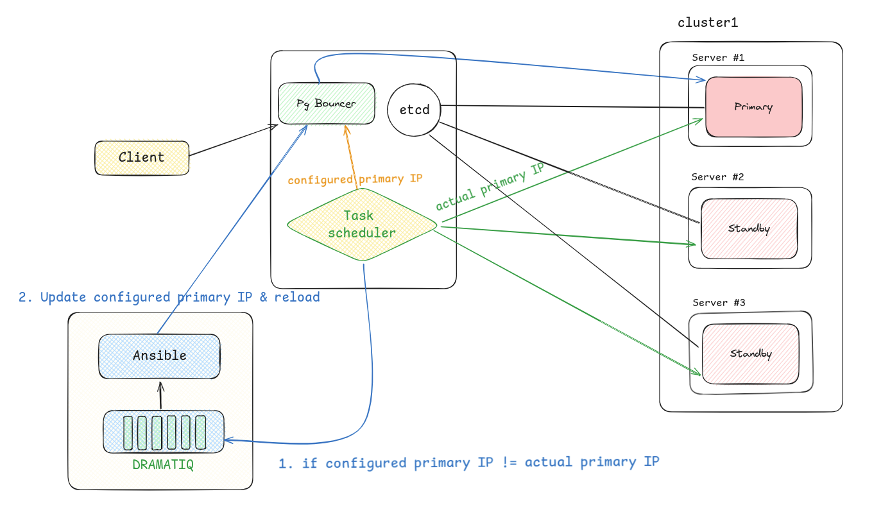

# Báo cáo tiến độ ngày 15/08/2024

## 1. Mục tiêu của mô hình đầu tiên

- Sử dụng connection pooling để tối ưu kết nối tới cụm DB
- Xử lý failover/switchover tối thiểu down-time
- Trả về 1 endpoint của primary database server

## 2. Mô hình triển khai


- Connection pooling PgBouncer: Sử dụng PgBouncer đứng giữa client và cụm DB, do mục tiêu cần trả về duy nhất 1 endpoint của primary database server, nên nếu có xảy ra failover/switchover sẽ thực hiện cấu hình lại và reload lại PgBouncer
- Dramatiq: Sử dụng để chạy những tác vụ tốn nhiều thời gian (so với HTTP request)
- Task scheduler: Giám sát thông tin về IP của primary server, khi xảy ra failover/switchover, sẽ thực hiện báo hiệu về Dramatiq để cập nhật cấu hình cho PgBouncer
- Ansible: Công cụ tự động hóa trong việc cập nhật lại cấu hình PgBouncer, cũng như tự động trong quá trình deploy cụm Patroni

## 3. Luồng thực hiện
- Ở trạng thái ổn định, PgBouncer sẽ luôn được cấu hình trỏ tới server của primary node (gọi là Configured Primary IP)
- Khi xảy ra failover, cụm Patroni sẽ tự động promote 1 DB mới (gọi là Actual Primary IP) lên thành primary, dẫn đến configured primary IP trong PgBouncer không còn trỏ đến primary mới này
- Task scheduler định kỳ (VD: 5s) thực hiện so sánh Configured Primary IP và Actual Primary IP, nếu có sự khác biệt chính tỏ PgBouncer cần cấu hình lại cho chính xác. Cụ thể cách so sánh như sau:

    + Task scheduler lấy Configured Primary IP của PgBouncer từ file pgbouncer.ini (là file cấu hình trạng thái của PgBouncer)
    + Task scheduler lấy Actual Primary IP bằng cách gửi HTTP health check tới 3 DB node. Đối với Patroni, primary node sẽ có response code là 200, replica node sẽ có response code là 500 (nhưng vẫn có data trong response)

- Nếu xảy ra khác biệt, Task Scheduler gửi yêu cầu tới Dramatiq. Sau đó Dramatiq sẽ sử dụng Ansible để update lại cấu hình PgBouncer theo Actual Primary IP được lấy ở trên.

## 4. Triển khai 

### 4.1. Triển khai cụm Patroni tự động với Ansible

Triển khai Patroni dạng service tới đồng thời tất cả các node trong cluster.

Triển khai DB etcd - key value dạng service

### 4.2. Triển khai các server quản lý cụm Patroni

PgBouncer và Task Scheduler được triển khai trong cùng 1 server, nhằm mục đích Task Scheduler dễ dàng đọc được config của PgBouncer. Trong tương lai, nếu 2 service này không cùng một server, cần thiết có thêm 1 service collect logs/metrics từ PgBouncer

#### Triển khai PgBouncer 
PgBouncer được triển khai dưới dạng docker

```ini
# File cấu hình pgbouncer.ini
[databases]
;; [config cluster: begin]
mydb = host={{ patroni_primary_host }} dbname=postgres auth_user=postgres pool_mode=session  pool_size=10
;; [config cluster: end]
[pgbouncer]
listen_addr = *
listen_port = 6432
auth_type = md5
auth_file= /etc/pgbouncer/userlist.txt
admin_users=postgres
```
Sử dụng `;; [config cluster: begin]` và `;; [config cluster: end]` để dễ dàng sử dụng Regex tách được host của pgbouncer (nhằm mục tiêu lấy được Configured Primary IP)


```
# File userlist.txt
"postgres" "md567b6684073537f1b234601ef409b2bc1"
```
Sử dụng file userlist.txt là các để xác thực người dùng kết nối tới PgBouncer

File userlist.txt có định dạng là "username" "MD5-hashed password", trong đó "MD5-hashed password" được lấy bởi 1 trong 2 cách

```
"md5" + md5(password + username)
```

```
postgres=# select rolname, rolpassword from pg_authid;
          rolname          |             rolpassword             
---------------------------+-------------------------------------
 pg_monitor                | 
 pg_read_all_settings      | 
 pg_read_all_stats         | 
 pg_stat_scan_tables       | 
 pg_read_server_files      | 
 pg_write_server_files     | 
 pg_execute_server_program | 
 pg_signal_backend         | 
 postgres                  | md567b6684073537f1b234601ef409b2bc1
 replicator                | md5bae9f954e068c972d5c7e752b393f586
 admin                     | md5f6fdffe48c908deb0f4c3bd36c032e72
```

#### Triển khai Task Scheduler

Task Scheduler được triển khai dạng docker, mount file config pgbouncer.ini vào trong container để có thể dễ dàng lấy được Configured Primary IP.

Logic chính trong triển khai Task Scheduler, định kỳ so sánh 2 IP
```python
IPs = os.getenv('IPS', '192.168.144.133,192.168.144.135,192.168.144.136').split(',')

while True:
    pgbouncer_configured_primary_ip = get_pgbouncer_primary_ip()
    actual_primary_ip = None
    for IP in IPs:
        endpoint = f"http://{IP}:{PORT}/"
        try:
            response = requests.get(endpoint)
            data = json.loads(response.text)
            status = response.status_code
            if status == 200 and data['role'] == 'master':
                actual_primary_ip = IP
        except requests.exceptions.RequestException as e:
            print(f"FAILOVER: {IP}")

    print("ACTUAL PRIMARY IP:", actual_primary_ip)
    print("CONFIGURED PRIMARY IP:", pgbouncer_configured_primary_ip)

    if actual_primary_ip and actual_primary_ip != pgbouncer_configured_primary_ip:
        update_cluster_state(actual_primary_ip)

    send_logging()
    time.sleep(int(os.getenv('CHECK_INTERVAL', 5)))

```

#### Triển khai Dramatiq

Trong bài demo lần này, chưa áp dụng triển khai Dramatiq, tạm thời đang sử dụng 1 Api server nhận request từ Task Scheduler.

Api server này sẽ được triển khai trong cùng Server với Ansible triển khai cụm

Logic chạu Ansible Playbook khi nhận được request cập nhật cấu hình pgbouncer.ini, tạo câu lệnh thực thi playbook và truyền vào extra variables `'patroni_primary_host': '192.168.144.130'`

```python
def run_ansible_playbook(playbook_path, extra_vars=None, inventory_path=None, remote_user=None):
    """
    Run an Ansible playbook with optional extra variables.
    
    :param playbook_path: Path to the Ansible playbook file.
    :param extra_vars: Dictionary of extra variables to pass to the playbook.
    :param inventory_path: Path to the inventory file.
    :param remote_user: Remote user to use for the playbook.
    :return: Dictionary with the result of the execution.
    """
    command = ["ansible-playbook", playbook_path]
    
    if inventory_path:
        command.extend(["-i", inventory_path])

    if extra_vars:
        extra_vars_str = " ".join(f"{key}={value}" for key, value in extra_vars.items())
        command.extend(["-e", extra_vars_str])
    
    if remote_user:
        command.extend(["-u", remote_user])
    
    print(command)
    try:
        result = subprocess.run(command, check=True, text=True, capture_output=True)
        print(result.stdout)
        return {"success": True, "output": result.stdout}
    except subprocess.CalledProcessError as e:
        return {"success": False, "error": e}

@app.route('/run_playbook', methods=['POST'])
def run_playbook():
    data = request.json
    print(data)
    playbook_path = '/home/vinh/Documents/postgresql-high-availability/ansible/playbooks/patroni_manage.yml'
    inventory_path = '/home/vinh/Documents/postgresql-high-availability/ansible/inventory.ini'
    remote_user = 'simone'
    extra_vars = data.get('extra_vars', {})
    # Format extra_vars = {
    #     'patroni_primary_host': '192.168.144.130'
    # }    

    if not playbook_path:
        return jsonify({"error": "playbook_path is required"}), 400

    result = run_ansible_playbook(playbook_path, extra_vars, inventory_path, remote_user)
    
    if result['success']:
        return jsonify(result)
    else:
        return jsonify(result), 500
```

## 5. Nhận xét downtime
- Mô hình trên vẫn chưa đạt được zero-downtime, vì có thể mất 1 khoảng thời gian = thời gian định kỳ so sánh 2 IP, hệ thống mới phát hiện được failover/switchover. (Trong triển khai là 5 giây), cộng thêm thời gian chạy playbook Ansible cập nhật lại cấu hình.

## 6. Hướng phát triển tiếp theo

- Hướng tới mục tiêu zero-downtime, giải pháp đưa thêm HaProxy vào mô hình triển khai 