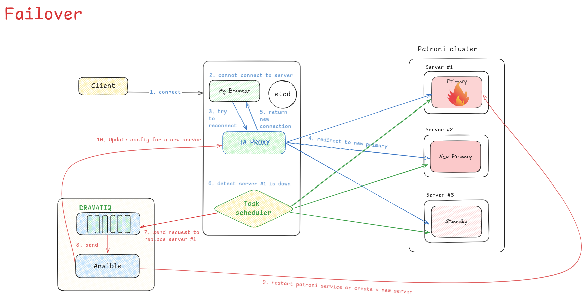

# Báo cáo tiến độ #2


### Mô hình triển khai


### Kịch bản failover


### Thử nghiệm

Log dramatiq khi cluster patroni ở trạng thái bình thường

```
Received message: Hello from the scheduler!
RUNNING: 192.168.144.133
RUNNING: 192.168.144.135
RUNNING: 192.168.144.136
================================
```

Thử nghiệm: Dừng node 1 trong cluster

```
vinh@node2:~$ patronictl -c /etc/patroni.yml list
+ Cluster: postgres (7404403235850823971) -----+----+-----------+
| Member | Host            | Role    | State   | TL | Lag in MB |
+--------+-----------------+---------+---------+----+-----------+
| node1  | 192.168.144.133 | Replica | stopped |    |   unknown |
| node2  | 192.168.144.135 | Leader  | running | 36 |           |
| node3  | 192.168.144.136 | Replica | running |    |        16 |
+--------+-----------------+---------+---------+----+-----------+
```

Thử nghiệm: Dramatiq job phát hiện thấy failover

```
Received message: Hello from the scheduler!
FAILOVER: 192.168.144.133
['ansible-playbook', '/home/vinh/Documents/postgresql-high-availability/ansible/playbooks/patroni_cluster.yml', '-i', '/home/vinh/Documents/postgresql-high-availability/ansible/inventory.ini', '-t', 'patroni', '--limit', '192.168.144.133', '-u', 'simone']
RUNNING: 192.168.144.135
RUNNING: 192.168.144.136
================================
```

Dramatiq job chạy Ansible để restart

```
PLAY [patroni_cluster] *********************************************************

TASK [Gathering Facts] *********************************************************
ok: [192.168.144.133]

TASK [../roles/patroni_cluster : Tạo nhóm 'patroni' nếu chưa tồn tại] **********
ok: [192.168.144.133]

TASK [../roles/patroni_cluster : Tạo user và group cho Patroni] ****************
ok: [192.168.144.133]

TASK [../roles/patroni_cluster : Tạo thư mục cho Patroni] **********************
ok: [192.168.144.133]

TASK [../roles/patroni_cluster : Tạo tệp cấu hình cho Patroni] *****************
ok: [192.168.144.133]

TASK [../roles/patroni_cluster : Tạo thư mục /data/patroni] ********************
ok: [192.168.144.133]

TASK [../roles/patroni_cluster : Tạo service systemd cho Patroni] **************
ok: [192.168.144.133]

TASK [../roles/patroni_cluster : Khởi động dịch vụ Patroni] ********************
changed: [192.168.144.133]

TASK [../roles/patroni_cluster : Kiểm tra trạng thái của dịch vụ Patroni] ******
ok: [192.168.144.133]

PLAY [manager_servers] *********************************************************
skipping: no hosts matched

PLAY RECAP *********************************************************************
192.168.144.133            : ok=9    changed=1    unreachable=0    failed=0    skipped=0    rescued=0    ignored=0 
```

Trạng thái sau khi thử restart node1

```
vinh@node2:~$ patronictl -c /etc/patroni.yml list
+ Cluster: postgres (7404403235850823971) -----+----+-----------+
| Member | Host            | Role    | State   | TL | Lag in MB |
+--------+-----------------+---------+---------+----+-----------+
| node1  | 192.168.144.133 | Replica | running |    |        16 |
| node2  | 192.168.144.135 | Leader  | running | 36 |           |
| node3  | 192.168.144.136 | Replica | running |    |        16 |
+--------+-----------------+---------+---------+----+-----------+
```


## Thêm 1 node vào cluster đang hoạt động

- Cluster đang hoạt động bình thường
- Cần thêm 1 node replica vào cluster

Kịch bản:
- Sử dụng Ansible tự động triển khai dịch vụ patroni lên 1 node mới
- Chỉnh sửa pg_hba của tất cả các node còn lại để cho phép node mới này
    + Sử dụng patronictl edit-config < cluster-name > để cập nhật pg_hba tới tất cả các node
    + Vì sau khi đã bootstrap, sẽ không thay đổi config thông qua file /etc/patroni.yml nữa
    
- Chỉnh sửa config haproxy để có thể điều hướng đến node mới này


## Monitoring

- Sử dụng một số exporter sau:
+ Node_exporter: Tạo các metrics liên quan đến VM đang chạy patroni
+ postgres_exporter
+ patroni_exporter
