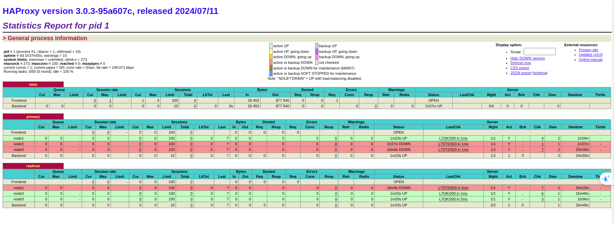
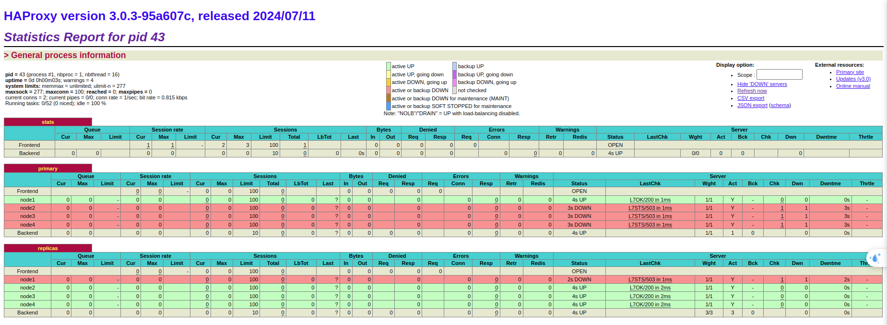

# Báo cáo tiến độ #3

## Mục tiêu:

- Đóng gói Patroni, customize config khi tạo container Patroni
- Image patroni đang đóng gói tất cả service liên quan (etcd, haproxy) nên size image khá nặng, cần tách riêng chỉ để lại patroni service trong image.
- Service haproxy cập nhật config khi có thay đổi về member của etcd (thêm/bớt) mà không restart
## Mục tiêu đóng gói

[Docker image của Patroni](https://github.com/patroni/patroni/tree/master/docker)

### Một số lưu ý về image trên:

- Image trên có thể tạo ra patroni hoặc etcd hoặc haproxy, tùy thuộc vào params, command đầu vào của `docker run` mà sẽ quyết định tạo nên loại instance nào

### Cần đạt được sau khi đóng gói:
- Patroni:
    + Đọc src code patroni lấy config (local_config, default_config, dynamic_config - từ env)
    + Thử customize config mới
    + Exec vào trong container thực hiện một số lệnh như failover, restart, reload, ...

- Etcd
    + Khả năng không chạy etcd theo image này
    + Note các cấu hình liên quan đến patroni, để nếu có phải sử dụng 1 etcd server riêng thì có thể cấu hình được
- Haproxy
    + Thử nghiệm thay đổi haproxy.cfg

- Thử thêm 1 node Patroni vào cluster
    + Kiểm tra có cần thay đổi pg_hba.conf của mỗi instance patroni không.
    + Cấu hình lại haproxy để có thể điều hướng tới node mới
    + Thử nghiệm failover/switchover tới node mới này
    + Thử nghiệm cho node mói làm leader và thực hiện query DML (insert, update), và xem các node cũ có được replica không.

- Tách riêng Patroni:
    + Cấu hình cho cụm patroni liên hệ với node Etcd trên 1 VM
    + Xóa download service liên quan trong Dockerfile

## Thử nghiệm

### 1. Patroni

Patroni lấy cấu hình từ 3 nơi: default_config, local_config, dynamic_config.

Trong đó,

- local_configuration là file config truyền vào Dockerfile (hiện tại đang là patroni0.yml). Nếu không truyền file yaml vào thì sẽ lấy __environment_configuration
- __environment_configuration có độ ưu tiên cao hơn file config mặc đinh
- dynamic_configuration được đọc từ patroni.dynamic.json, sau đó lưu vào cache
```
# File $PGHOME/data/patroni.dynamic.json
{"ttl": 30, "loop_wait": 10, "retry_timeout": 10, "maximum_lag_on_failover": 1048576, "postgresql": {"use_pg_rewind": true, "pg_hba": ["local all all trust", "host replication replicator all md5", "host all all all md5"], "parameters": {"max_connections": 100}}}
```

Một số env variables có thể dùng để cấu hình khi tạo container.
Chi tiết về test xem thêm tại file test_config.py:33

```python
os.environ.update({
    'PATRONI_NAME': 'postgres0',
    'PATRONI_NAMESPACE': '/patroni/',
    'PATRONI_SCOPE': 'batman2',
    'PATRONI_LOGLEVEL': 'ERROR',
    'PATRONI_LOG_FORMAT': '["message", {"levelname": "level"}]',
    'PATRONI_LOG_LOGGERS': 'patroni.postmaster: WARNING, urllib3: DEBUG',
    'PATRONI_LOG_FILE_NUM': '5',
    'PATRONI_LOG_MODE': '0123',
    'PATRONI_CITUS_DATABASE': 'citus',
    'PATRONI_CITUS_GROUP': '0',
    'PATRONI_CITUS_HOST': '0',
    'PATRONI_RESTAPI_USERNAME': 'username',
    'PATRONI_RESTAPI_PASSWORD': 'password',
    'PATRONI_RESTAPI_LISTEN': '0.0.0.0:8008',
    'PATRONI_RESTAPI_CONNECT_ADDRESS': '127.0.0.1:8008',
    'PATRONI_RESTAPI_CERTFILE': '/certfile',
    'PATRONI_RESTAPI_KEYFILE': '/keyfile',
    'PATRONI_RESTAPI_ALLOWLIST_INCLUDE_MEMBERS': 'on',
    'PATRONI_POSTGRESQL_LISTEN': '0.0.0.0:5432',
    'PATRONI_POSTGRESQL_CONNECT_ADDRESS': '127.0.0.1:5432',
    'PATRONI_POSTGRESQL_PROXY_ADDRESS': '127.0.0.1:5433',
    'PATRONI_POSTGRESQL_DATA_DIR': 'data/postgres0',
    'PATRONI_POSTGRESQL_CONFIG_DIR': 'data/postgres0',
    'PATRONI_POSTGRESQL_PGPASS': '/tmp/pgpass0',
    'PATRONI_ETCD_HOST': '127.0.0.1:2379',
    'PATRONI_ETCD_URL': 'https://127.0.0.1:2379',
    'PATRONI_ETCD_PROXY': 'http://127.0.0.1:2379',
    'PATRONI_ETCD_SRV': 'test',
    'PATRONI_ETCD_CACERT': '/cacert',
    'PATRONI_ETCD_CERT': '/cert',
    'PATRONI_ETCD_KEY': '/key',
    'PATRONI_CONSUL_HOST': '127.0.0.1:8500',
    'PATRONI_CONSUL_REGISTER_SERVICE': 'on',
    'PATRONI_KUBERNETES_LABELS': 'a: b: c',
    'PATRONI_KUBERNETES_SCOPE_LABEL': 'a',
    'PATRONI_KUBERNETES_PORTS': '[{"name": "postgresql"}]',
    'PATRONI_KUBERNETES_RETRIABLE_HTTP_CODES': '401',
    'PATRONI_ZOOKEEPER_HOSTS': "'host1:2181','host2:2181'",
    'PATRONI_EXHIBITOR_HOSTS': 'host1,host2',
    'PATRONI_EXHIBITOR_PORT': '8181',
    'PATRONI_RAFT_PARTNER_ADDRS': "'host1:1234','host2:1234'",
    'PATRONI_foo_HOSTS': '[host1,host2',  # Exception in parse_list
    'PATRONI_SUPERUSER_USERNAME': 'postgres',
    'PATRONI_SUPERUSER_PASSWORD': 'patroni',
    'PATRONI_REPLICATION_USERNAME': 'replicator',
    'PATRONI_REPLICATION_PASSWORD': 'rep-pass',
    'PATRONI_admin_PASSWORD': 'admin',
    'PATRONI_admin_OPTIONS': 'createrole,createdb',
    'PATRONI_POSTGRESQL_BIN_POSTGRES': 'sergtsop'
})
```


### 2. Etcd

Thử nghiệm chạy 1 service etcd trên 1 server riêng, và patroni cluster kết nối tới.

```
# Cập nhật file docker-compose.yaml
ETCDCTL_ENDPOINTS: http://192.168.144.146:2379
PATRONI_ETCD3_HOSTS: "'192.168.144.146:2379'"
PATRONI_SCOPE: demo2
```

Kết quả: Kết nối bình thường
```
+ Cluster: demo2 (7405478835460010007) -------+----+-----------+
| Member   | Host       | Role    | State     | TL | Lag in MB |
+----------+------------+---------+-----------+----+-----------+
| patroni1 | 172.23.0.5 | Leader  | running   |  1 |           |
| patroni2 | 172.23.0.4 | Replica | streaming |  1 |         0 |
| patroni3 | 172.23.0.3 | Replica | streaming |  1 |         0 |
+----------+------------+---------+-----------+----+-----------+
```
### 3. Haproxy

Khi có yêu cầu thêm/bớt số lượng node, Haproxy cần được cấu hình nhưng không được restart, vì nếu restart sẽ tạo ra 1 khoảng thời gian downtime cho hệ thống.

Haproxy chạy tiến trình và lưu tiến trình đó vào /var/run/haproxy.pid

Sử dụng Haproxy kết hợp với confd, khi có thay đổi về cấu hình từng node (thêm/bớt số lượng node), Confd sẽ interval 10s (theo cấu hình hiện tại) gửi yêu cầu lấy các key-value cần thiết từ server etcd và chạy lại tiến trình Haproxy được lưu trong /var/run/haproxy.pid sau đó ghi đè lại vào /var/run/haproxy.pid. Do đó Haproxy sẽ được cập nhật mà không bị restart lại. 

```shell
vinh@vinhbh-20:~$ etcdctl get "/service/demo7" --prefix
/service/demo7/config
{"ttl":30,"loop_wait":10,"retry_timeout":10,"maximum_lag_on_failover":1048576,"postgresql":{"use_pg_rewind":true,"pg_hba":["local all all trust","host replication replicator all md5","host all all all md5"],"parameters":{"max_connections":100}}}
/service/demo7/initialize
7406229148830257290
/service/demo7/leader
node1
/service/demo7/members/node1
{"conn_url":"postgres://192.168.144.133:5432/postgres","api_url":"http://192.168.144.133:8008/patroni","state":"running","role":"master","version":"3.3.2","xlog_location":67108864,"timeline":1}
/service/demo7/members/node2
{"conn_url":"postgres://192.168.144.135:5432/postgres","api_url":"http://192.168.144.135:8008/patroni","state":"running","role":"replica","version":"3.3.2","xlog_location":67108864,"replication_state":"streaming","timeline":1}
/service/demo7/members/node3
{"conn_url":"postgres://192.168.144.136:5432/postgres","api_url":"http://192.168.144.136:8008/patroni","state":"running","role":"replica","version":"3.3.2","xlog_location":67108864,"replication_state":"streaming","timeline":1}
/service/demo7/status
{"optime":67108864}
```




Thêm node4 vào cluster

```shell
vinh@vinhbh-20:~$ etcdctl get "/service/demo7" --prefix
/service/demo7/config
{"ttl":30,"loop_wait":10,"retry_timeout":10,"maximum_lag_on_failover":1048576,"postgresql":{"use_pg_rewind":true,"pg_hba":["local all all trust","host replication replicator all md5","host all all all md5"],"parameters":{"max_connections":100}}}
/service/demo7/initialize
7406229148830257290
/service/demo7/leader
node1
/service/demo7/members/node1
{"conn_url":"postgres://192.168.144.133:5432/postgres","api_url":"http://192.168.144.133:8008/patroni","state":"running","role":"master","version":"3.3.2","xlog_location":100663392,"timeline":1}
/service/demo7/members/node2
{"conn_url":"postgres://192.168.144.135:5432/postgres","api_url":"http://192.168.144.135:8008/patroni","state":"running","role":"replica","version":"3.3.2","xlog_location":100663392,"replication_state":"streaming","timeline":1}
/service/demo7/members/node3
{"conn_url":"postgres://192.168.144.136:5432/postgres","api_url":"http://192.168.144.136:8008/patroni","state":"running","role":"replica","version":"3.3.2","xlog_location":100663392,"replication_state":"streaming","timeline":1}
/service/demo7/members/node4
{"conn_url":"postgres://192.168.144.149:5432/postgres","api_url":"http://192.168.144.149:8008/patroni","state":"running","role":"replica","version":"3.3.2","xlog_location":100663392,"replication_state":"streaming","timeline":1}
/service/demo7/status
{"optime":100663392}
```

Haproxy tự động update fiel config và chạy lại tiến trình.



Việc tự động này sẽ tăng khả năng auto scaling cho hệ thống, tương tự PgBouncer cũng sẽ sử dụng confd để tự động cập nhật cấu hình.

### 4. Tách riêng Patroni

Khi triển khai patroni, cần sửa đổi 2 endpoint kết nối postgresql và restapi, trong đó:

- Kết nối postgresql để các node replica có thể đồng bộ dữ liệu, nên endpoint này cũng cần được truy cập từ tất cả các node patroni
- Kết nối restapi để các node patroni có thể monitoring lẫn nhau, nên endpoint này cũng cần được truy cập từ tất cả các node patroni

```
PATRONI_RESTAPI_USERNAME=admin
PATRONI_RESTAPI_PASSWORD=admin
PATRONI_SUPERUSER_USERNAME=postgres
PATRONI_SUPERUSER_PASSWORD=some-password
PATRONI_REPLICATION_USERNAME=replicator
PATRONI_REPLICATION_PASSWORD=replicate
PATRONI_admin_PASSWORD=admin
PATRONI_admin_OPTIONS=createdb,createrole
PATRONI_RESTAPI_CONNECT_ADDRESS={{ hostvars[inventory_hostname]['ansible_host'] }}:8008
PATRONI_POSTGRESQL_CONNECT_ADDRESS={{ hostvars[inventory_hostname]['ansible_host'] }}:5432
```

Hiện tại, chạy Patroni trong docker container nhưng endpoint có IP là IP của VM (ansible_host) và sẽ mount 2 port 8008 và 5432 vào trong container, vì vậy khi gọi vào 2 endpoint trên sẽ trỏ đến Patroni chạy trong container

