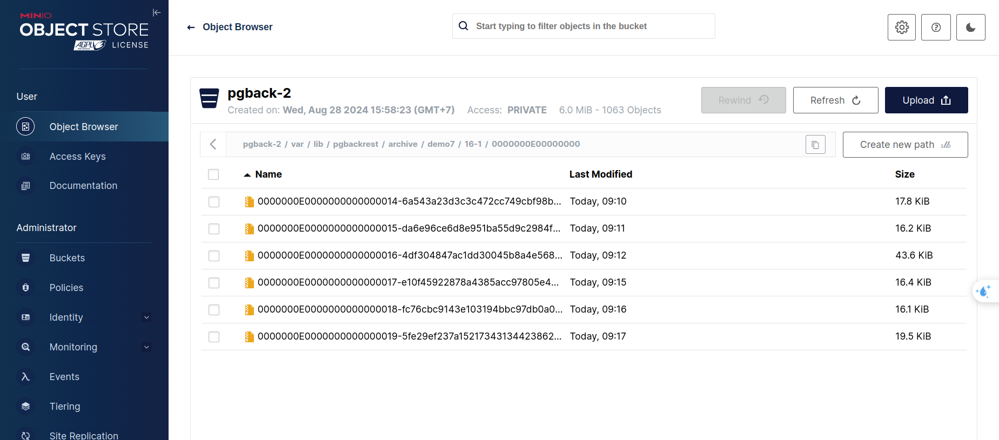

# Báo cáo tiến độ #4

## Mục tiêu:
- Backup restore:
    + Nghiên cứu tool pgbackreast, đưa ra so sánh với các tool khác
    + Nghiên cứu các vấn đề gặp phải khi backup restore
    + Cài đặt pgbackrest, PITR

- WAL:
    + Nghiên cứu WAL, rotate, mối quan hệ, Postgres xử lý như thế nào


--archive-push-queue-max


1. Full Backup

Định nghĩa: Một bản sao lưu đầy đủ, lưu trữ tất cả các dữ liệu từ hệ thống hoặc tập tin mục tiêu.

Ưu điểm: Đảm bảo toàn bộ dữ liệu đều được sao lưu, dễ dàng phục hồi do không phụ thuộc vào các bản sao lưu khác.

Nhược điểm: Thời gian và dung lượng lưu trữ lớn.

2. Incremental Backup

Định nghĩa: Chỉ sao lưu những thay đổi (dữ liệu mới hoặc thay đổi) so với lần sao lưu gần nhất (dù là full backup hay incremental backup trước đó).

Ưu điểm: Nhanh chóng và tiết kiệm dung lượng, vì chỉ sao lưu những thay đổi.

Nhược điểm: Quá trình phục hồi phức tạp hơn, vì cần kết hợp các bản sao lưu incremental và full backup ban đầu.

3. Differential Backup

Định nghĩa: Sao lưu tất cả các thay đổi kể từ lần full backup cuối cùng. Mỗi lần differential backup sẽ bao gồm tất cả các thay đổi kể từ lần full backup, không chỉ những thay đổi từ lần sao lưu gần nhất.

Ưu điểm: Phục hồi nhanh hơn so với incremental backup vì chỉ cần bản sao lưu đầy đủ và bản differential backup gần nhất.

Nhược điểm: Dung lượng lưu trữ tăng dần theo thời gian giữa các lần full backup.


## pgBackRest

### Chức năng chính:

Một công cụ sao lưu và khôi phục nâng cao dành cho PostgreSQL, hỗ trợ cả sao lưu full, incremental, và differential.

### Ưu điểm:

- Hỗ trợ incremental và differential backup: Giảm thiểu dung lượng lưu trữ và thời gian sao lưu bằng cách chỉ sao lưu các thay đổi kể từ lần sao lưu trước.
- Tính năng nén và mã hóa: pgBackRest hỗ trợ nén và mã hóa dữ liệu tự động, giúp bảo mật và tối ưu hóa không gian lưu trữ.
- Quản lý sao lưu hiệu quả: Hỗ trợ quản lý nhiều backup sets, giữ lại các bản sao lưu theo lịch trình, và xóa các bản sao lưu cũ một cách tự động.
- Hỗ trợ PITR (Point-In-Time Recovery): Cho phép khôi phục cơ sở dữ liệu đến một thời điểm cụ thể, sử dụng các tệp WAL để đảm bảo dữ liệu toàn vẹn.
- Khả năng mở rộng và hiệu suất cao: Thiết kế để hỗ trợ các môi trường với nhiều máy chủ, các cơ sở dữ liệu lớn và yêu cầu khắt khe về hiệu suất.

### Nhược điểm:
- Phức tạp hơn trong cấu hình và quản lý: Cần cài đặt và cấu hình riêng, không đơn giản như pg_basebackup.
- Yêu cầu hiểu biết sâu về hệ thống: Do tính năng phức tạp và nhiều tùy chọn, cần phải hiểu rõ cách hoạt động để cấu hình chính xác và khai thác hết các tính năng của nó


By default pgBackRest will attempt to perform an incremental backup. However, an incremental backup must be based on a full backup and since no full backup existed pgBackRest ran a full backup instead.

The type option can be used to specify a full or differential backup.

```
sudo -u postgres pgbackrest --stanza=demo --type=diff \
       --log-level-console=info backup
```

## Quá trình backup

Tình trạng áp dụng: Cluster đã bootstrap từ trước


### Tạo file cấu hình cho pgbackrest
Tạo file cấu hình cho pgbackrest, cần chỉ ra các storage muốn lưu trữ 

Trong demo này sử dụng AWS s3

Tạo file /etc/pgbackrest.conf:

Chú ý: 
- [demo7] là tên stanza
- `pg1-path=/home/postgres/data` là thư mục chứa data của patroni (postgres). Vì lúc cấu hình patroni đã đặt là ~/data 
```ini
[global]
repo1-type=s3
repo1-storage-verify-tls=n
repo1-s3-endpoint=s3.amazonaws.com
repo1-s3-uri-style=path
repo1-s3-bucket=pgback-2608
repo1-s3-key=****************
repo1-s3-key-secret=Zy********************
repo1-s3-region=us-east-1

repo1-path=/var/lib/pgbackrest
repo1-retention-full=2
start-fast=y
log-level-console=info
log-level-file=debug
delta=y
process-max=2

[demo7]
pg1-path=/home/postgres/data
pg1-port=5432
pg1-user=postgres
```

### Tạo stanza


```shell
pgbackrest --stanza=demo7 stanza-create
================
postgres@node1:~/data$ pgbackrest --stanza=demo7 stanza-create
2024-08-26 07:27:53.413 P00   INFO: stanza-create command begin 2.53.1: --exec-id=2539-dc0eb0a1 --log-level-console=info --log-level-file=debug --pg1-path=/home/postgres/data --pg1-port=5432 --pg1-user=postgres --repo1-path=/repo1 --repo1-s3-bucket=pgback-2608 --repo1-s3-endpoint=s3.amazonaws.com --repo1-s3-key=<redacted> --repo1-s3-key-secret=<redacted> --repo1-s3-region=us-east-1 --repo1-s3-uri-style=path --no-repo1-storage-verify-tls --repo1-type=s3 --stanza=demo7
2024-08-26 07:27:54.036 P00  ERROR: [056]: unable to find primary cluster - cannot proceed
                                    HINT: are all available clusters in recovery?
2024-08-26 07:27:54.038 P00   INFO: stanza-create command end: aborted with exception [056]
=================
postgres@node2:~$ pgbackrest --stanza=demo7 stanza-create
2024-08-26 07:28:51.284 P00   INFO: stanza-create command begin 2.53.1: --exec-id=2541-486276b7 --log-level-console=info --log-level-file=debug --pg1-path=/home/postgres/data --pg1-port=5432 --pg1-user=postgres --repo1-path=/repo1 --repo1-s3-bucket=pgback-2608 --repo1-s3-endpoint=s3.amazonaws.com --repo1-s3-key=<redacted> --repo1-s3-key-secret=<redacted> --repo1-s3-region=us-east-1 --repo1-s3-uri-style=path --no-repo1-storage-verify-tls --repo1-type=s3 --stanza=demo7
2024-08-26 07:28:51.890 P00   INFO: stanza-create for stanza 'demo7' on repo1
```

Nếu trước đó, cluster chưa được cấu hình archive backup khi cấu hình lúc bootstrap, thì cần sử dụng edit-config

#### Chú ý không dùng cách edit file config sau đó reload, cách này không dùng được cho những cấu hình trong section bootstrap

Nếu chạy edit-config thế này thì khó tự động, khả năng lúc cấu hình bootstrap sẽ cấu hình archive_command luôn, còn archive_mode: "off"
Cần edit-config thì dùng sed file

```shell
patronictl -c /etc/patroni.yml edit-config

## adjust the following lines
postgresql:
  parameters:
    archive_command: pgbackrest --stanza=demo7 archive-push "%p"
    archive_mode: "on"
```

Sau đó restart/reload để áp dụng lại cấu hình mới
```shell
postgres@node1:~/data/global$ patronictl list
+ Cluster: demo7 (7407339322157844293) ----------+----+-----------+-----------------+------------------------+
| Member | Host            | Role    | State     | TL | Lag in MB | Pending restart | Pending restart reason |
+--------+-----------------+---------+-----------+----+-----------+-----------------+------------------------+
| node1  | 192.168.144.133 | Replica | streaming |  1 |         0 | *               | archive_mode: off->on  |
| node2  | 192.168.144.135 | Leader  | running   |  1 |           | *               | archive_mode: off->on  |
| node3  | 192.168.144.136 | Replica | streaming |  1 |         0 | *               | archive_mode: off->on  |
+--------+-----------------+---------+-----------+----+-----------+-----------------+------------------------+
```

```shell
# Chạy trên leader thì được ???
postgres@node2:~$ patronictl restart demo7
+ Cluster: demo7 (7407349965812375605) ----------+----+-----------+-----------------+--------------------------+
| Member | Host            | Role    | State     | TL | Lag in MB | Pending restart | Pending restart reason   |
+--------+-----------------+---------+-----------+----+-----------+-----------------+--------------------------+
| node2  | 192.168.144.135 | Leader  | running   |  2 |           |                 |                          |
| node3  | 192.168.144.136 | Replica | streaming |  2 |         0 | *               | max_connections: 100->99 |
+--------+-----------------+---------+-----------+----+-----------+-----------------+--------------------------+
When should the restart take place (e.g. 2024-08-26T09:17)  [now]: ^CAbopostgres@node2:~$ pgbackrest --stanza=demo7 stanza-create
2024-08-26 08:20:01.141 P00   INFO: stanza-create command begin 2.53.1: --exec-id=2306-971ae9a2 --log-level-console=info --log-level-file=debug --pg1-path=/home/postgres/data --pg1-port=5432 --pg1-user=postgres --repo1-path=/var/lib/pgbackrest --repo1-s3-bucket=pgback-2608 --repo1-s3-endpoint=s3.amazonaws.com --repo1-s3-key=<redacted> --repo1-s3-key-secret=<redacted> --repo1-s3-region=us-east-1 --repo1-s3-uri-style=path --no-repo1-storage-verify-tls --repo1-type=s3 --stanza=demo7
2024-08-26 08:20:01.746 P00   INFO: stanza-create for stanza 'demo7' on repo1
2024-08-26 08:20:08.644 P00   INFO: stanza-create command end: completed successfully (7505ms)
```

Kiểm tra trên s3 đã có thư mục var/


### Thực hiện backup lần đầu tiên
```shell
pgbackrest --stanza=demo7 backup
```

```shell
postgres@node2:~$ pgbackrest --stanza=demo7 backup
2024-08-26 08:29:12.503 P00   INFO: backup command begin 2.53.1: --delta --exec-id=2534-65bd48c4 --log-level-console=info --log-level-file=debug --pg1-path=/home/postgres/data --pg1-port=5432 --pg1-user=postgres --process-max=2 --repo1-path=/var/lib/pgbackrest --repo1-retention-full=2 --repo1-s3-bucket=pgback-2608 --repo1-s3-endpoint=s3.amazonaws.com --repo1-s3-key=<redacted> --repo1-s3-key-secret=<redacted> --repo1-s3-region=us-east-1 --repo1-s3-uri-style=path --no-repo1-storage-verify-tls --repo1-type=s3 --stanza=demo7 --start-fast
2024-08-26 08:29:16.152 P00   WARN: no prior backup exists, incr backup has been changed to full
2024-08-26 08:29:16.153 P00   INFO: execute non-exclusive backup start: backup begins after the requested immediate checkpoint completes
2024-08-26 08:29:16.554 P00   INFO: backup start archive = 000000020000000000000009, lsn = 0/9000028
2024-08-26 08:29:16.555 P00   INFO: check archive for prior segment 000000020000000000000008
2024-08-26 08:34:46.230 P00   INFO: execute non-exclusive backup stop and wait for all WAL segments to archive
2024-08-26 08:34:46.432 P00   INFO: backup stop archive = 000000020000000000000009, lsn = 0/9000138
2024-08-26 08:34:48.315 P00   INFO: check archive for segment(s) 000000020000000000000009:000000020000000000000009
2024-08-26 08:34:53.284 P00   INFO: new backup label = 20240826-082916F
2024-08-26 08:35:07.119 P00   INFO: full backup size = 22.2MB, file total = 973
2024-08-26 08:35:07.120 P00   INFO: backup command end: completed successfully (354618ms)
2024-08-26 08:35:07.120 P00   INFO: expire command begin 2.53.1: --exec-id=2534-65bd48c4 --log-level-console=info --log-level-file=debug --repo1-path=/var/lib/pgbackrest --repo1-retention-full=2 --repo1-s3-bucket=pgback-2608 --repo1-s3-endpoint=s3.amazonaws.com --repo1-s3-key=<redacted> --repo1-s3-key-secret=<redacted> --repo1-s3-region=us-east-1 --repo1-s3-uri-style=path --no-repo1-storage-verify-tls --repo1-type=s3 --stanza=demo7
2024-08-26 08:35:11.725 P00   INFO: expire command end: completed successfully (4605ms)
```

Chú ý, mặc định đang dùng incremental backup, nhưng vì trước đó chưa có full backup nên pgbackrest chuyển sang full backup


### Xem thông tin đã backup của stanza
```shell
postgres@node2:~$ pgbackrest info
stanza: demo7
    status: ok
    cipher: none

    db (current)
        wal archive min/max (16): 000000010000000000000001/000000020000000000000009

        full backup: 20240826-082916F
            timestamp start/stop: 2024-08-26 08:29:16+00 / 2024-08-26 08:34:46+00
            wal start/stop: 000000020000000000000009 / 000000020000000000000009
            database size: 22.2MB, database backup size: 22.2MB
            repo1: backup set size: 2.9MB, backup size: 2.9MB
```


## Quá trình Restore

### [1] Đối với cluster chưa cấu hình restore lúc bootstrap, cần edit config

Với cluster chưa cấu hình restore lúc bootstrap, cần edit config. Khả năng áp dụng trong trường hợp đang chạy cluster nhưng muốn PITR

```shell
postgres@node2:~$ patronictl edit-config

recovery_conf:
    recovery_target_timeline: latest
    restore_command: pgbackrest --stanza=demo7 archive-get %f "%p"
```


### [2] Nếu backup, sau đó xóa cluster, một thòi gian sau tạo cluster lại với bản backup cũ

Khi tạo cluster mới, sẽ sử dụng custom bootstrap

```yaml
bootstrap:
  dcs:
    ttl: 30
    loop_wait: 10
    retry_timeout: 10
    maximum_lag_on_failover: 1048576
    postgresql:
      use_pg_rewind: true
      pg_hba:
      ...
      parameters:
        wal_level: replica
        archive_mode: 'on'
        archive_command: pgbackrest --stanza=demo7 archive-push %p
        max_connections: 100
      recovery_conf:
        recovery_target_timeline: latest
        restore_command: pgbackrest --stanza=demo7 archive-get %f "%p"
  method: pgbackrest
  pgbackrest:
    command: /bin/bash -c "pgbackrest --stanza=demo7 restore"
    keep_existing_recovery_conf: True
    no_paramas: False
    recovery_conf:
      recovery_target_action: promote
      recovery_target_timeline: latest
      restore_command: pgbackrest --stanza=demo7 archive-get %f "%p"

postgresql:
  .........
  create_replica_methods:
    - pgbackrest
    - basebackup
  pgbackrest:
    command: pgbackrest --stanza=demo7 restore
    keep_data: True
    no_params: True
  basebackup:
    checkpoint: 'fast'
```


```

# Đang thực hiện bootstrap cho leader

postgres@node1:~$ patronictl list
+ Cluster: demo7 (initializing) -----+---------------------------------+----+-----------+
| Member | Host            | Role    | State                           | TL | Lag in MB |
+--------+-----------------+---------+---------------------------------+----+-----------+
| node1  | 192.168.144.133 | Replica | stopped                         |    |   unknown |
| node2  | 192.168.144.135 | Replica | running custom bootstrap script |    |   unknown |
| node3  | 192.168.144.136 | Replica | stopped                         |    |   unknown |
+--------+-----------------+---------+---------------------------------+----+-----------+

postgres@node1:~$ patronictl list
+ Cluster: demo7 (initializing) -----+----------+----+-----------+
| Member | Host            | Role    | State    | TL | Lag in MB |
+--------+-----------------+---------+----------+----+-----------+
| node1  | 192.168.144.133 | Replica | stopped  |    |   unknown |
| node2  | 192.168.144.135 | Replica | starting |    |   unknown |
| node3  | 192.168.144.136 | Replica | stopped  |    |   unknown |
+--------+-----------------+---------+----------+----+-----------+

# Thực hiện bootstrap from leader 'node2'

postgres@node1:~$ patronictl list
+ Cluster: demo7 (7407349965812375605) -----------------+----+-----------+
| Member | Host            | Role    | State            | TL | Lag in MB |
+--------+-----------------+---------+------------------+----+-----------+
| node1  | 192.168.144.133 | Replica | creating replica |    |   unknown |
| node2  | 192.168.144.135 | Leader  | running          |  3 |           |
| node3  | 192.168.144.136 | Replica | creating replica |    |   unknown |
+--------+-----------------+---------+------------------+----+-----------+

postgres@node1:~$ patronictl list
+ Cluster: demo7 (7407349965812375605) ---------+----+-----------+
| Member | Host            | Role    | State    | TL | Lag in MB |
+--------+-----------------+---------+----------+----+-----------+
| node1  | 192.168.144.133 | Replica | starting |    |   unknown |
| node2  | 192.168.144.135 | Leader  | running  |  3 |           |
| node3  | 192.168.144.136 | Replica | starting |    |   unknown |
+--------+-----------------+---------+----------+----+-----------+

```

Kiểm tra lại data sau khi restore
```
vinh@node2:~$ sudo docker exec -it demo-node2 /bin/bash
postgres@node2:~$ psql
psql (16.4 (Debian 16.4-1.pgdg120+1))
Type "help" for help.

postgres=# \d
        List of relations
 Schema | Name | Type  |  Owner   
--------+------+-------+----------
 public | tmp1 | table | postgres
(1 row)

postgres=# select * from tmp1;
 id 
----
  1
  2
(2 rows)

postgres=# \d
        List of relations
 Schema | Name | Type  |  Owner   
--------+------+-------+----------
 public | tmp1 | table | postgres
(1 row)

```

## Thử nghiệm thêm:
### Kịch bản 1: Reinit 1 replica và add 1 node vào cluster, xem có chạy vào command này hay không
```
create_replica_methods:
    - pgbackrest
    - basebackup
  pgbackrest:
    command: pgbackrest --stanza=demo7 restore
    keep_data: True
    no_params: True
  basebackup:
    checkpoint: 'fast'
```

```
Which member do you want to reinitialize [node3, node1]? []: node3
Are you sure you want to reinitialize members node3? [y/N]: y
Success: reinitialize for member node3
postgres@node1:~$ patronictl list
postgres@node1:~$ patronictl list
+ Cluster: demo7 (7407349965812375605) -----------------+----+-----------+
| Member | Host            | Role    | State            | TL | Lag in MB |
+--------+-----------------+---------+------------------+----+-----------+
| node1  | 192.168.144.133 | Replica | streaming        |  3 |         0 |
| node2  | 192.168.144.135 | Leader  | running          |  3 |           |
| node3  | 192.168.144.136 | Replica | creating replica |    |   unknown |
| node4  | 192.168.144.149 | Replica | creating replica |    |   unknown |
+--------+-----------------+---------+------------------+----+-----------+

postgres@node1:~$ patronictl list
+ Cluster: demo7 (7407349965812375605) --------------------+----+-----------+
| Member | Host            | Role    | State               | TL | Lag in MB |
+--------+-----------------+---------+---------------------+----+-----------+
| node1  | 192.168.144.133 | Replica | streaming           |  3 |         0 |
| node2  | 192.168.144.135 | Leader  | running             |  3 |           |
| node3  | 192.168.144.136 | Replica | in archive recovery |  3 |         0 |
| node4  | 192.168.144.149 | Replica | creating replica    |    |   unknown |
+--------+-----------------+---------+---------------------+----+-----------+
postgres@node1:~$ patronictl list
+ Cluster: demo7 (7407349965812375605) ----------+----+-----------+
| Member | Host            | Role    | State     | TL | Lag in MB |
+--------+-----------------+---------+-----------+----+-----------+
| node1  | 192.168.144.133 | Replica | streaming |  3 |         0 |
| node2  | 192.168.144.135 | Leader  | running   |  3 |           |
| node3  | 192.168.144.136 | Replica | streaming |  3 |         0 |
| node4  | 192.168.144.149 | Replica | streaming |  3 |         0 |
+--------+-----------------+---------+-----------+----+-----------+

Dữ liệu đuọc đồng bộ trên tất cả các node
```

### Kịch bản 2: PITR

```
pgbackrest --stanza=demo7 --delta \
--type=time "--target=2024-08-27 06:52:00.322658+00" \
--target-action=promote restore
```

Trong demo, sử dụng `archive_timeout: 60s` để định kỳ 60s sẽ push file WAL lên S3 storage, để đảm bảo dữ liệu sẽ mới trong vòng 60s kể từ lúc bị lỗi muốn restore.


Giả sử trên cluster `demo27` đang có 2 bảng quan trọng là `nums` và `important_data`
Lúc 09:14, thêm bản ghi `914` vào bảng `nums`
Lúc 09:16, thêm bản ghi `916` vào bảng `nums` và `drop table important_data`
Cần khôi phục về trước 09:16 để restore về thời điểm trước khi lỡ drop bảng quan trọng, expect sẽ mất bản ghi `916` của bảng `nums`
```
postgres=# select now();
              now              
-------------------------------
 2024-08-29 02:16:48.936925+00
(1 row)

```


Dữ liệu file WAL được đẩy lên s3 storage


#### Thực hiện PITR

Trong file cấu hình patroni, vẫn cần 2 đoạn recovery_conf ở postgresql và pgbackrest
1. Nếu không có recovery_conf ở postgresql thì chỉ có leader recover thành công, còn các replica sẽ bị lỗi recover
Khả năng vì recovery_conf ở pgbackrest chỉ áp dụng cho leader khi bootstrap cluster
2. Nếu không có recovery_conf ở pgbackrest thì khi bootstrap, leader sẽ recover về latest time chứ không phải thời gian chỉ định (PITR)

```yaml
# Thực hiện dựng cluster mới và quay trở về lúc 09:14

bootstrap:
  dcs:
    postgresql:
      parameters:
        archive_mode: 'on'
        archive_command: pgbackrest --stanza=demo7 archive-push %p
        archive_timeout: 60s
        max_connections: 100
        recovery_conf:
          recovery_target_time: "2024-08-29 02:14:48"
          restore_command: pgbackrest --stanza=demo7 archive-get %f "%p"
          recovery_target_action: promote
  method: pgbackrest
  pgbackrest:
    command: /etc/custom_bootstrap.sh
    keep_existing_recovery_conf: True
    no_paramas: True
    recovery_conf:
      recovery_target_time: "2024-08-29 02:14:48"
      recovery_target_action: promote
      restore_command: pgbackrest --stanza=demo7 archive-get %f "%p"
```

Hoặc có thể sử dụng cách remove cluster patroni (patronictl remove < old_cluster_name >).

Hoặc có thể xóa initial key trong initialize `etcdctl del "/service/demo27/initialize"` để cluster tự động bootstrap lại.


Kết quả truy vấn đã trở về lúc 09:14

### Thử nghiệm 3: Tiếp tục insert dữ liệu vào PITR. Và restore tới dữ liệu mới


Thực hiện thêm 3 bản ghi 917, 930, 931 lần lượt vào lúc 09:29, 09:30, 09:31
```
postgres=# insert into nums values (930);
INSERT 0 1
postgres=# insert into nums values (931);
INSERT 0 1
postgres=# select * from nums;
  id  
------
 1600
 1603
 1604
 1605
 1637
  910
  911
  914
  917
  930
  931
(11 rows)

```

Thử nghiệm: Quay về lúc 09:30 xem có mất bản ghi 09:31 không và liệu Pgbackrest có apply bản ghi `916` và `drop table important_data` không.

```
postgres=# select * from nums;
  id  
------
 1600
 1603
 1604
 1605
 1637
  910
  911
  914
  917
  930
(10 rows)

postgres=# select * from important_data 
postgres-# ^C
postgres=# \d
             List of relations
 Schema |      Name      | Type  |  Owner   
--------+----------------+-------+----------
 public | important_data | table | postgres
 public | nums           | table | postgres
(2 rows)

postgres=# select * from nums;
  id  
------
 1600
 1603
 1604
 1605
 1637
  910
  911
  914
  917
  930
(10 rows)

postgres=# select * from important_data;
        id        
------------------
 important record
(1 row)

postgres=# 
\q
postgres@node1:~$ patronictl list
+ Cluster: demo27_recover_3 (7408112455031263268) ---------+----+-----------+
| Member | Host            | Role    | State               | TL | Lag in MB |
+--------+-----------------+---------+---------------------+----+-----------+
| node1  | 192.168.144.133 | Leader  | running             | 20 |           |
| node2  | 192.168.144.135 | Replica | in archive recovery | 19 |         0 |
| node3  | 192.168.144.136 | Replica | in archive recovery | 19 |         0 |
+--------+-----------------+---------+---------------------+----+-----------+
postgres@node1:~$ patronictl list
+ Cluster: demo27_recover_3 (7408112455031263268) ----+-----------+
| Member | Host            | Role    | State     | TL | Lag in MB |
+--------+-----------------+---------+-----------+----+-----------+
| node1  | 192.168.144.133 | Leader  | running   | 20 |           |
| node2  | 192.168.144.135 | Replica | streaming | 19 |         0 |
| node3  | 192.168.144.136 | Replica | streaming | 19 |         0 |
+--------+-----------------+---------+-----------+----+-----------+
```

Nhận xét: Dữ liệu không apply khoảng thòi gian từ 09:14 -> 09:16 của lần recover trước (Hợp lý)
Tức là dữ liệu hiện tại là 
`từ đầu -> 09:14` -----> `09:14 -> 09:30` (đã bỏ 09:14 -> 09:16 của lần recover trước)

## Ref:
- [pgbackrest.org user-guide](https://pgbackrest.org/user-guide.html)

- [Protecting your data with Patroni and pgBackRest](https://pgday.ru/presentation/298/60f04d9ae4105.pdf)

- [pgstef's blog](https://pgstef.github.io/2022/07/12/patroni_and_pgbackrest_combined.html)

- [pmatseykanets - pgBackRest](https://pmatseykanets.github.io/pgbackrest-docs/)

- [Bootstrap Patroni Cluster from pgBackRest Backup](https://www.dbi-services.com/blog/bootstrap-patroni-cluster-from-pgbackrest-backup/)

- [Recreate a Patroni replica using pgBackRest](https://www.dbi-services.com/blog/recreate-a-patroni-replica-using-pgbackrest/)

- [Backup From a Standby](https://pmatseykanets.github.io/pgbackrest-docs/guide/backup_from_standby.html)

- [Percona - pgbackrest restoration](https://www.percona.com/blog/pgbackrest-restoration-scenarios/)

- [Percona - Rebuild Patroni Replica Using pgBackRest](https://www.percona.com/blog/rebuild-patroni-replica-using-pgbackrest/)