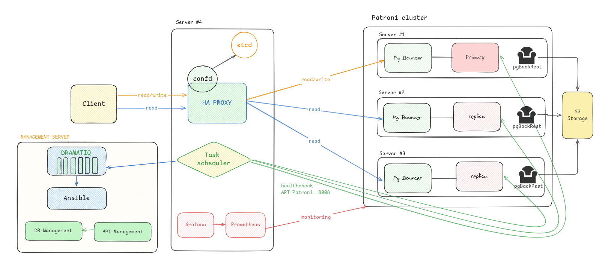

# Báo cáo tiến độ #5

## Mục tiêu
- Thực hiện luồng cũ:
    + Thực hiện lại luồng cũ
    + Thay đổi image mới
    + Thiết kế luồng tự động quá trình backup, restore laster, PITR

- Nghiên cứu Cách thức hoạt động của Patroni:
    + Tại sao dùng etcd, ko dùng thì sao….
    + Cách giao tiếp giữa các instance
    + Cách quorum khi failover
    + Cách chuyển đổi nhanh leader

- Nghiên cứu backup/restore của pgbackrest:
    + Từ postgresql, file nào quyết định restore 
    + pgbackrest tác động lên postgresql như thế nào, sao nó biết pull từ s3 về

- Nghiên cứu thêm:
    + Cách thực hoạt động WAL, khi nào rotate, mối quan hệ
    + Setup kích thước file WAL tối ưu

- so sánh backup/restore
- liệt kê thành phần trong kiến trúc
- backend quản lý + DB lưu thông tin người dùng - cluster (bao nhiêu node sống/die, haproxy là gì, confd là gì, task manager là gì...)

- log sequence number
- backup stdin.out.err streams

Các thành phần của kiến trúc:

- API Management: Dịch vụ API quản lý thông tin tài nguyên được cấp phát cho khách hàng, cung cấp một số thôn tin như: thông tin về cụm database, trạng thái healthcheck các node trong cụm, ...

- DB Management: Dịch vụ database lưu thông tin dữ liệu cho API Management.

- Promethues, grafana: Dịch vụ monitoring trạng thái của cụm DB như quan sát RAM, CPU, và các metrics được patroni cung cấp (qua endpoint /metrics của patroni)
 
- confd bên trong haproxy; dịch vụ liên tục cập nhật thông tin các node từ etcd, load lại config haproxy mà không gây gián đoạn về dịch vụ haproxy

