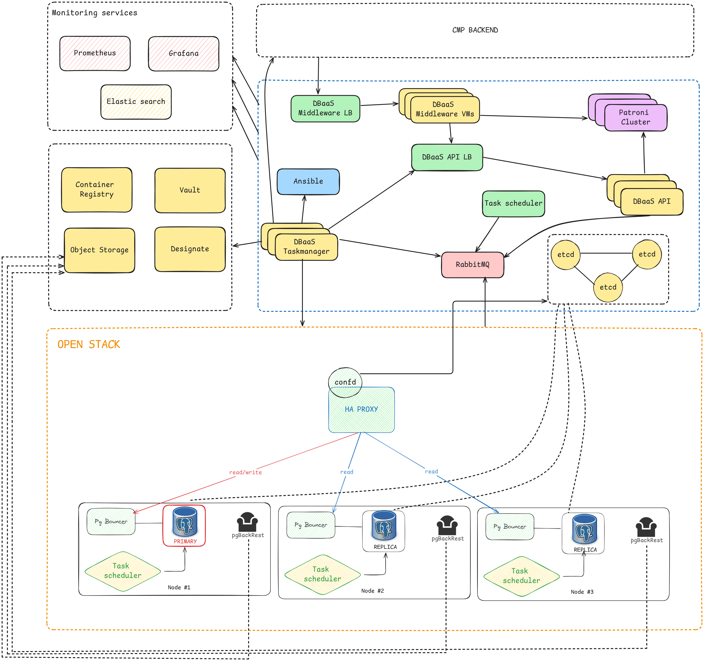
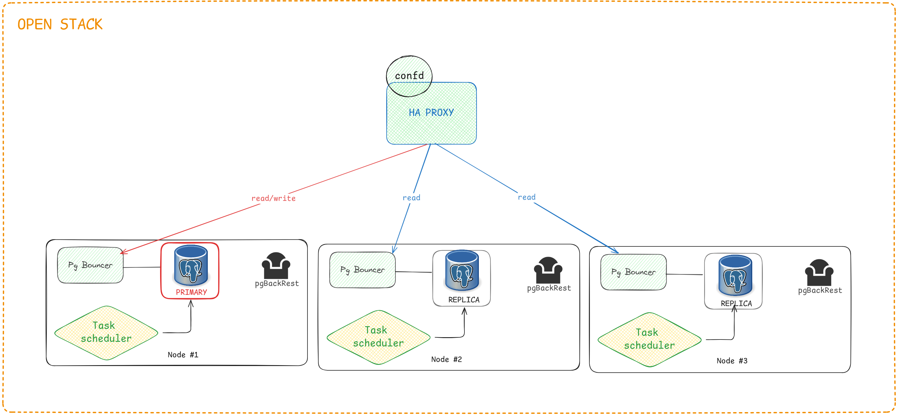
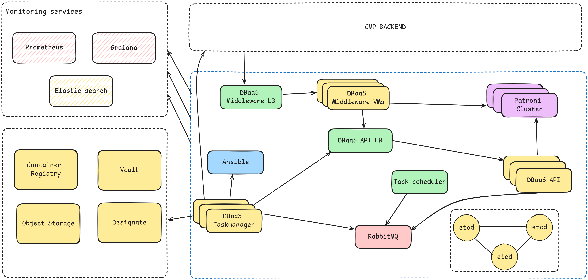
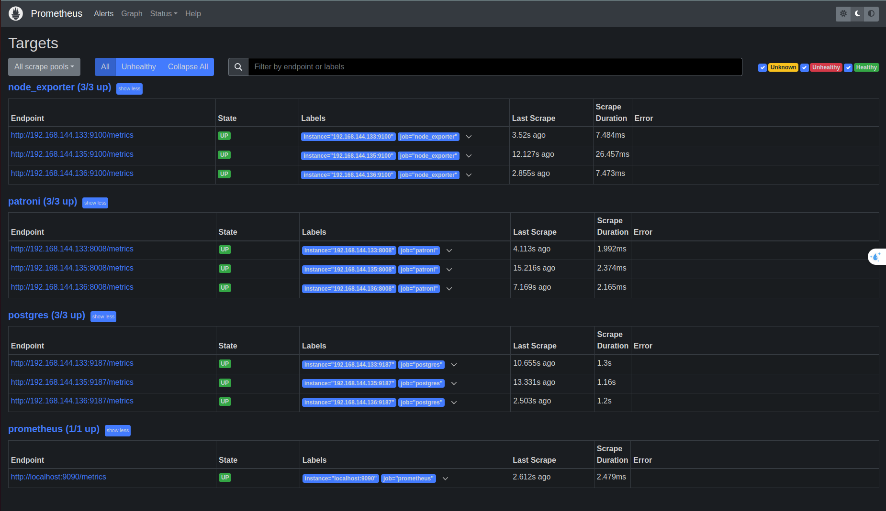
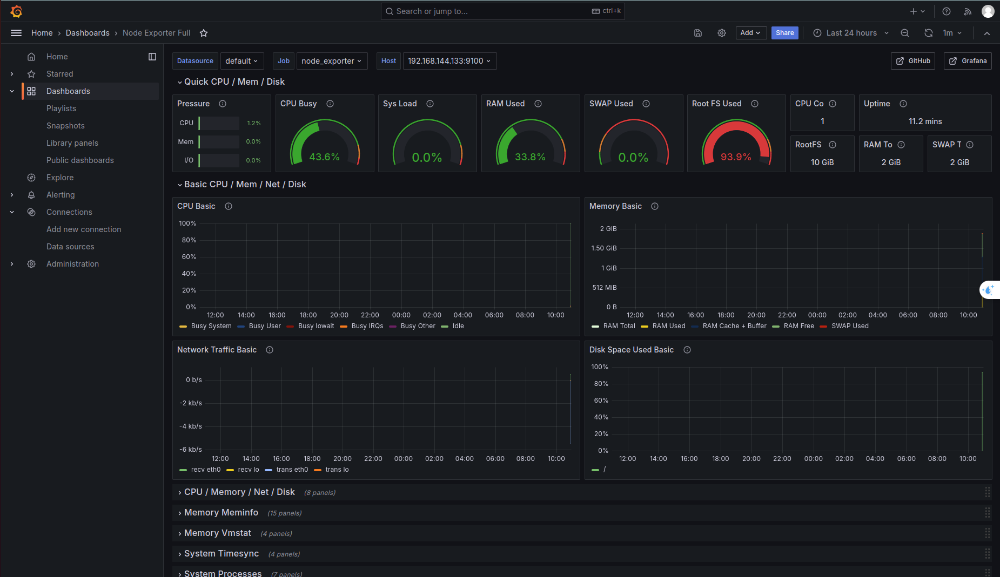
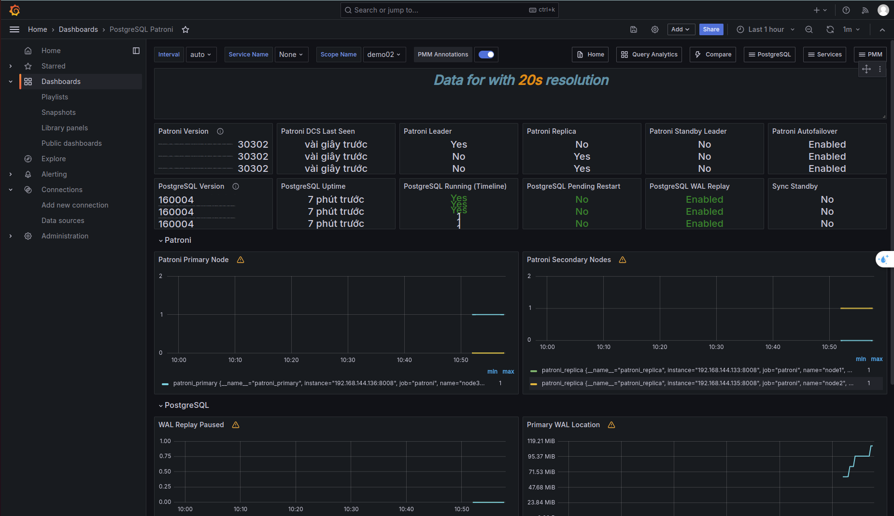
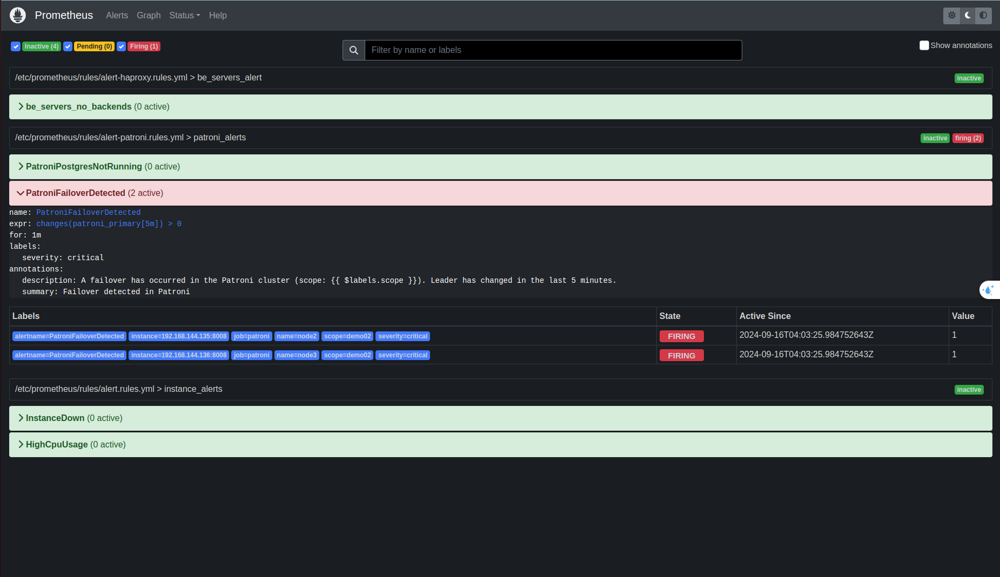
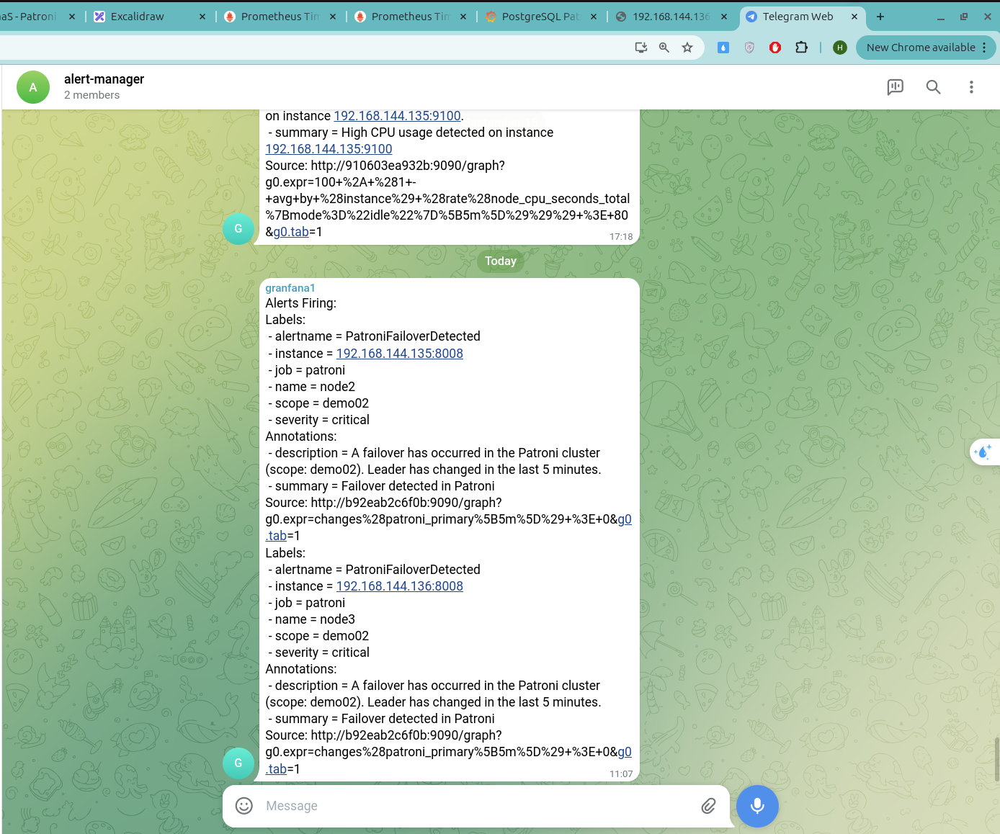

# Báo cáo tiến độ #5

## Mục tiêu
- Thực hiện luồng cũ:
    + Thực hiện lại luồng cũ
    + Thay đổi image mới
    + Thiết kế luồng tự động quá trình backup, restore laster, PITR

- Nghiên cứu Cách thức hoạt động của Patroni:
    + Tại sao dùng etcd, ko dùng thì sao….
    + Cách giao tiếp giữa các instance
    + Cách quorum khi failover
    + Cách chuyển đổi nhanh leader

- Nghiên cứu backup/restore của pgbackrest:
    + Từ postgresql, file nào quyết định restore 
    + pgbackrest tác động lên postgresql như thế nào, sao nó biết pull từ s3 về

- Nghiên cứu thêm:
    + Cách thực hoạt động WAL, khi nào rotate, mối quan hệ
    + Setup kích thước file WAL tối ưu

Note: 
- so sánh backup/restore
- liệt kê thành phần trong kiến trúc
- backend quản lý + DB lưu thông tin người dùng - cluster (bao nhiêu node sống/die, haproxy là gì, confd là gì, task manager là gì...)

- log sequence number
- backup stdin.out.err streams

## Kiến trúc hệ thống

Kiến trúc:


Openstack:


Các service liên quan:

### Các thành phần của kiến trúc:

- Etcd cluster: Một nhóm các máy chủ etcd hoạt động cùng nhau để cung cấp lưu trữ phân tán, nhất quán và có khả năng chịu lỗi. Etcd là một kho khóa-giá trị phân tán. Patroni sử dụng etcd như một kho lưu trữ phân tán để quản lý trạng thái của cụm PostgreSQL và điều phối các hành động như chuyển đổi vai trò leader khi có sự cố

- Trong mỗi node của cụm Patroni bao gồm các thành phần:
    + Patroni service: Hệ thống quản lý và điều phối PostgreSQL high availability (HA)
    + Pg Bouncer: PgBouncer là một connection pooler (bộ gom kết nối) nhẹ dành cho PostgreSQL, giúp quản lý các kết nối từ ứng dụng đến PostgreSQL, giảm thiểu tài nguyên cần thiết và cải thiện hiệu suất bằng cách tối ưu hóa cách các kết nối được sử dụng
    + Task scheduler: Dịch vụ có vai trò lập lịch thực hiện healhcheck Database
    + PgBackRest: Dịch vụ thực hiện backup/restore trong mỗi node
- Haproxy kết hợp confd: 
    + Haproxy: HAProxy hỗ trợ việc điều phối truy cập đến node leader và các node replica của cụm PostgreSQL do Patroni quản lý
    + Confd: dịch vụ liên tục cập nhật thông tin các node từ etcd, load lại config haproxy mà không gây gián đoạn về dịch vụ haproxy


- Dramqtiq: thực hiện việc xử lý background tasks (công việc chạy nền) và message queues

- Ansible: Tool thực hiện việc nhận phân phối từ Dramatiq thực hiện các công việc tự động như cấu hình các service cần thiết cho 1 node patroni mới, hoặc restart dịch vụ patroni

- API Management: Dịch vụ API quản lý thông tin tài nguyên được cấp phát cho khách hàng, cung cấp một số thôn tin như: thông tin về cụm database, trạng thái healthcheck các node trong cụm, ...

- LB: Thành phần load balancer đứng trước API Management để đảm bảo cân bằng tải kết nôi từ Client tới API Management.

- DB Management: Dịch vụ database lưu thông tin dữ liệu cho API Management.

- Promethues, grafana: Dịch vụ monitoring trạng thái của cụm DB như quan sát RAM, CPU, và các metrics được patroni cung cấp (qua endpoint /metrics của patroni)

## Triển khai hệ thống


### Haproxy kết hợp confd
```tmpl
listen primary
	bind *:5000
	option httpchk HEAD /primary
	http-check expect status 200
	default-server inter 3s fall 3 rise 2 on-marked-down shutdown-sessions
{{range gets "/members/*"}}	server {{base .Key}} {{$data := json .Value}}{{base (replace (replace (index (split $data.conn_url "/") 2) "5432" "6432" -1) "@" "/" -1)}} maxconn 100 check port {{index (split (index (split $data.api_url "/") 2) ":") 1}}
{{end}}
listen replicas
	bind *:5001
	option httpchk HEAD /replica
	http-check expect status 200
	default-server inter 3s fall 3 rise 2 on-marked-down shutdown-sessions
{{range gets "/members/*"}}	server {{base .Key}} {{$data := json .Value}}{{base (replace (replace (index (split $data.conn_url "/") 2) "5432" "6432" -1) "@" "/" -1)}} maxconn 100 check port {{index (split (index (split $data.api_url "/") 2) ":") 1}}
{{end}}
```

Trong đó:

```
{{range gets "/members/*"}}	server {{base .Key}} {{$data := json .Value}}{{base (replace (replace (index (split $data.conn_url "/") 2) "5432" "6432" -1) "@" "/" -1)}} maxconn 100 check port {{index (split (index (split $data.api_url "/") 2) ":") 1}}
{{end}}
```

Đoạn code trên có tách dụng liệt kê các node trong cluster, sau đó đổi cổng kết nối từ 5432 (postgresql) thanh 6432 (thông qua PgBouncer), vẫn giữ nguyên healthcheck tại cổng 8008

## API Service
- Customer:
    + [GET] /users/:userId 

    + [POST] /users

    + [PUT] /users

    + [DELETE] /users


- Patroni cluster
    + [GET] /clusters/:clusterId

    + [POST] /clusters/:clusterId

    + [PUT] /clusters/:clusterId

    + [DELETE] /clusters/:clusterId


- Patroni features
    + [POST] /clusters/:clusterId/failover

    + [POST] /clusters/:clusterId/switchover

## Monitoring

1. Prometheus Targets



2. Node Exporter:


3. Postgres Patroni:


4. Cảnh báo về Telegram khi có failover xảy ra


