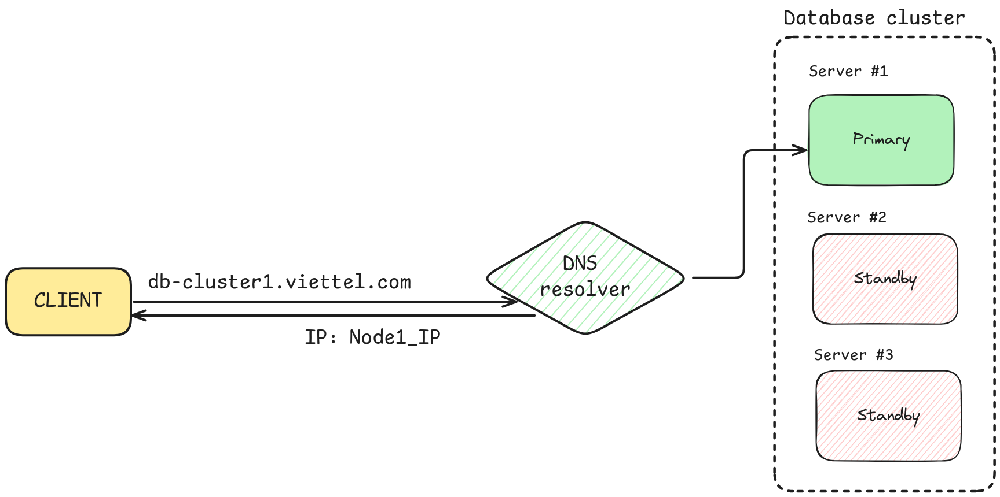
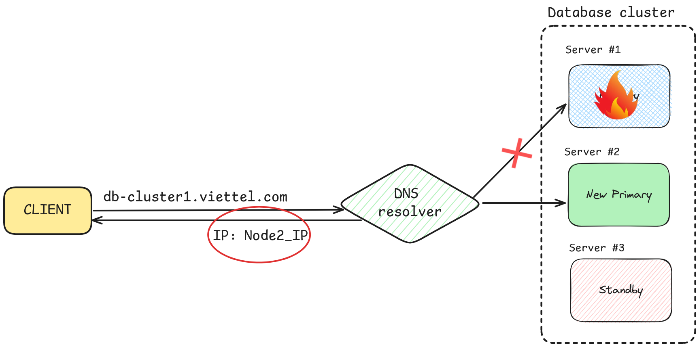
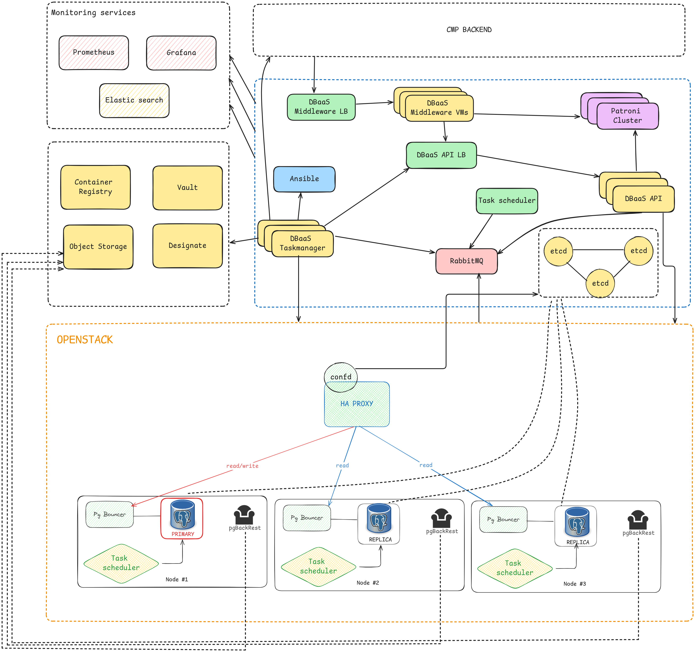
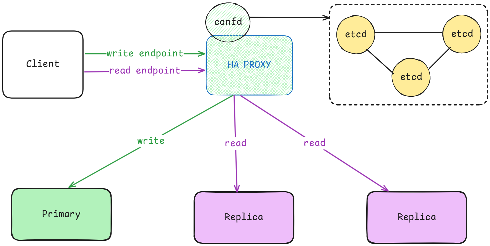
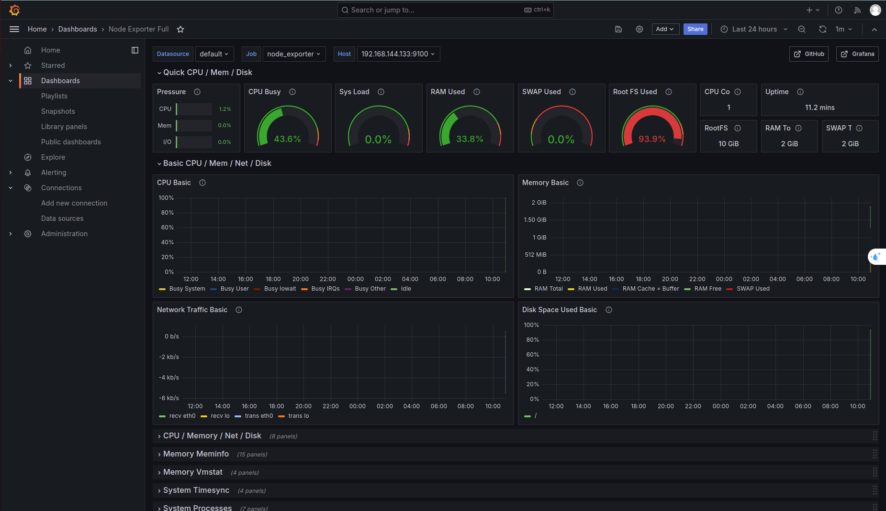
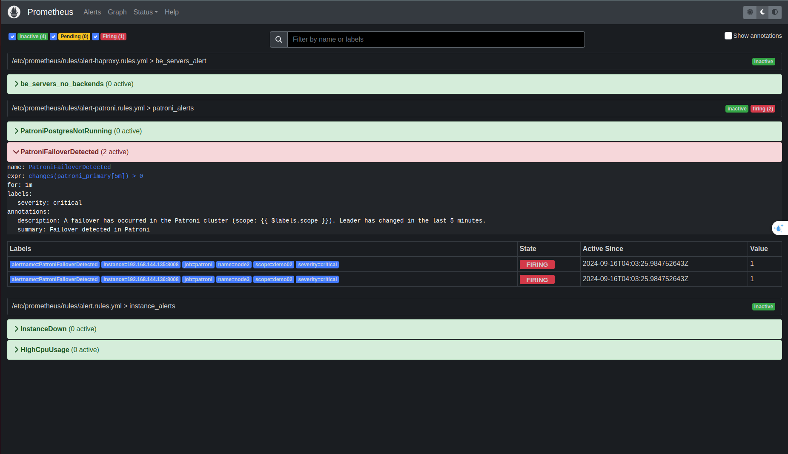
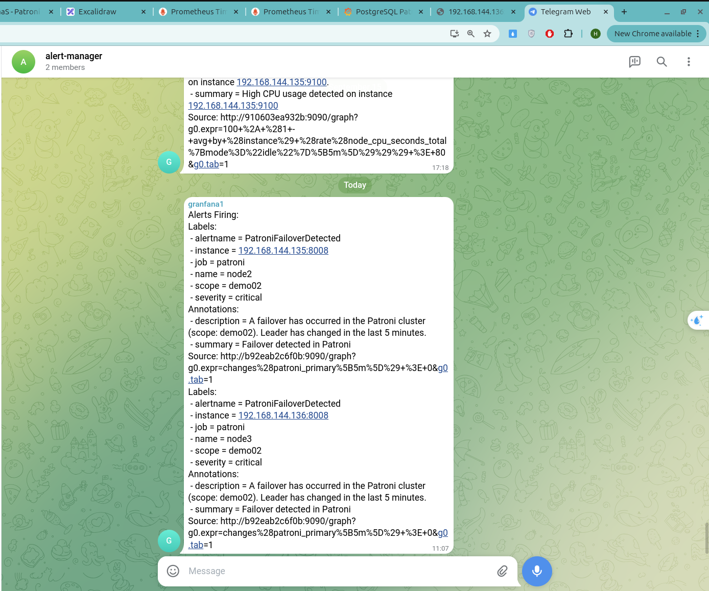

## I. Đặt vấn đề

Trong bối cảnh hiện nay, khi database đã trở thành 1 trong những thành phần quan trọng trong toàn hệ thống. Nếu một thời điểm nào đó database bị down-time (không sẵn sàng), gần như cả doanh nghiệp sẽ bị ảnh hưởng nghiêm trọng về cả tài chính lẫn uy tín.

Các dịch vụ cơ sở dữ liệu (DBaaS) đóng vai trò quan trọng trong việc lưu trữ và quản lý dữ liệu, đặc biệt đối với các hệ thống đòi hỏi tính sẵn sàng cao (HA) và khả năng mở rộng. 

Tuy nhiên, việc đảm bảo hệ thống DBaaS có thể hoạt động liên tục mà không bị gián đoạn là một thách thức lớn, đặc biệt trong các tình huống xảy ra lỗi hệ thống, máy chủ hoặc mạng. Các doanh nghiệp luôn đối mặt với nguy cơ mất dữ liệu hoặc gián đoạn dịch vụ, gây thiệt hại nghiêm trọng về cả tài chính lẫn uy tín.
### Hiện trạng trong hệ thống của Cloud

#### Mô hình hiện tại

Mô hình cụm Database gồm nhiều node instance. Trong đó gồm 01 node Primary và 01 hay nhiều node Standby và dữ liệu từ Primary sẽ được streaming replication tới các node Standby để đồng bộ. Trả về cho người dùng 1 endpoint duy nhất dạng tên miền cố định trỏ tới địa chi IP của node Primary. Các thao tác đọc ghi đều được thực hiện trên node Primary này. Các node Standby hiện chỉ giữ vai trò chờ đợi khi có sự cố và được promote trở thành Primary, chứ chưa thực hiện phân tải các thao tác đọc, giảm gánh nặng cho Primary

Với yêu cầu cần xử lý nhanh việc thay đổi IP thường xuyên, cần thiết phải sử dụng 1 công cụ như reverse proxy hay keepalived VIP

#### Hướng xử lý Failover:
Khi phát hiện sự kiện Failover xảy ra, hệ thống tiến hành chuyển đổi vai trò Primary sang 1 node Standby phù hợp nhất, quá trình này thường mất khoảng 5 phút. Quá trình down-time này có thể dài hơn nếu còn DNS cache ttl ở phía khách hàng.

## II. Giải pháp

### 1. Giải pháp Đảm bảo tính sẵn sàng cao cho cụm Database
#### PostgreSQL Streaming Replication với Replication Manager (repmgr): 
repmgr là một công cụ quản lý replica và thực hiện failover cho PostgreSQL, cho phép thiết lập streaming replication và quản lý cụm

Không cần hệ thống điều phối phân tán (etcd, Consul) nên đơn giản hơn về thiết lập. Tuy nhiên khả năng failover còn thiếu linh hoạt 

#### Patroni

Patroni, một giải pháp mã nguồn mở dựa trên PostgreSQL, đã nổi lên như một công cụ mạnh mẽ giúp quản lý các cụm cơ sở dữ liệu với tính năng sẵn sàng cao, tự động khôi phục khi gặp sự cố và tối ưu hóa quá trình chuyển đổi giữa các node trong cụm. Sử dụng các hệ thống quản lý đồng thuận phân tán như etcd, ZooKeeper để  quyết định node nào đóng vai trò leader  và lưu toàn bộ trạng thái của cluster (Node nào đang hoạt động, node nào đã dừng hoạt động).

Patroni phù hợp hơn cho các môi trường phức tạp, cloud-native, hoặc container-based như Kubernetes

#### So sánh repmgr và patroni
- repmgr: Khả năng mở rộng và khả năng điều phối kém linh hoạt, có thể xảy ra hiện tượng split brain
- repmgr ít được tích hợp với các hệ thống container như Kubernetes
- repmgr có khả năng tích hợp với hệ thống monitoring kém hơn so với Patroni.
- Việc chuyển đổi role (failover/switchover) có thể cần thêm sự can thiệp của quản trị viên so với Patroni

Cần sử dụng 1 proxy đứng trước cụm database để giải quyết vấn đề chuyển đổi địa chỉ truy cập khi có thay đổi về Primary

Tận dụng được khả năng đọc ở các node Replica để giảm tải gánh nặng tới Primary

### 2. Giải pháp nhanh chóng điều hướng tới Node mới khi xảy ra Failover

### Haproxy kết hợp Confd
Haproxy giữ vai trò đứng trước cụm DB, phân tán tải tới các node. Các thao tác ghi sẽ được chuyển tới Node Primary, Các thao tác đọc sẽ được phân tán đều tới các node Replica
Điều kiện để Haproxy biết được node nào là Primary, Node nào là replica là do Patroni đã cung cấp 1 API cho biết trạng thái và vai trò của từng Node trong cụm
Kết hợp với Confd, trong trường hợp có thay đổi server về các node trong cụm, ví dụ thêm/bớt/thay thế Node, Confd sẽ thấy sự thay đôi này trên ETCD và cập nhật lại cấu hình cho Haproxy mà không xảy ra down-time

Hệ thống sẽ trả về cho người dùng 2 endpoint
- write endpoint: trỏ tới IP của Haproxy, cổng 5000
- read endpoint: trỏ tới IP của Haproxy, cổng 5001

### ETCD Cluster
etcd là một kho key-value trị phân tán, mạnh mẽ và nhất quán, được sử dụng trong Patroni để quản lý trạng thái của cụm PostgreSQL và đảm bảo tính sẵn sàng cao (HA). etcd cung cấp cơ chế nhất quán, đáng tin cậy và phân tán để quản lý các quyết định quan trọng như failover, giúp đảm bảo rằng cụm PostgreSQL luôn duy trì tính HA.
Trong kiến trúc này, ETCD Cluster là 1 thành phần có thể dùng chung cho nhiều cụm Database khác nhau.

### PgBouncer
PgBouncer là một lightweight connection pooler dành cho PostgreSQL, giúp quản lý và tối ưu hóa các kết nối đến cơ sở dữ liệu. Mục tiêu chính của PgBouncer là giảm tải cho PostgreSQL bằng cách tái sử dụng và giới hạn số lượng kết nối từ các ứng dụng

## PgBackRest
pgBackRest là một công cụ sao lưu và khôi phục mạnh mẽ dành cho PostgreSQL, được thiết kế để hỗ trợ các yêu cầu sao lưu ở quy mô lớn với hiệu suất cao và độ tin cậy. pgBackRest hỗ trợ tốt trong môi trường có tính sẵn sàng cao như Patroni, cho phép backup từ các node standby mà không ảnh hưởng đến node chính.

## III. Triển khai kiến trúc giải pháp

### 1. Task scheduler, Task manager
Tự động lập lịch healthcheck, khi có 1 node không còn khả năng hoạt động trong cluster, task manager sẽ tự động trigger ansible restart docker container, nếu không được sẽ tự động tạo node mới và thêm vào cluster, cấu hình xóa node cũ. Vậy nên khi có 1 node down, cluster sẽ không xảy ra down-time, chỉ trong khoảng vài phút node lỗi sẽ được khôi phục

### 2. Phát triển DBaaS API 

DBaaS API kết hợp Ansible hỗ trợ việc xử lý các công việc tự động:
- Cung cấp API tạo Patroni Database cluster
- Cung cấp API chủ động failover, switchover
- Cung cấp API chủ động thêm/ bớt node

### 3. Disaster Recovery với Standby Cluster
Standby Cluster là một cụm PostgreSQL phụ (secondary cluster) chạy ở chế độ chỉ đọc, đồng bộ hóa dữ liệu từ một cụm chính (primary cluster) thông qua streaming replication. Standby Cluster có thể nhanh chóng được kích hoạt (promoted) để trở thành cụm chính trong tình huống xảy ra thảm họa cấp độ region (disaster recovery).

Khi xảy ra thảm họa cấp độ Region, task manager phát hiện toàn bộ node trong Primary cluster đồng loạt dừng hoạt động, sẽ kích hoạt Standby Cluster trở thành Primary Cluster mới. Đồng thời Haproxy Confd cũng sẽ cập nhật kịp thời để chuyển toàn bộ request về phía Cluster mới này.

### 4. Monitoring: Prometheus, Grafana, AlertManager

Sử dụng Prometheus để giám sát các thông số trong cụm database, 
- node-exporter để giám sát resource trên mỗi server (Ram,  CPU, ...).
- Postgres-exporter và Patroni-exporter để giám sát các thông số về database (Số node đang hoạt động, trạng thái từng node, độ delay, ...)

Sử dụng Grafana để visualize các metrics lên giao diện để thuận tiện cho người giám sát 

AlertManager được setup rule gửi cảnh báo khi cao tải (trên 80% CPU, hoặc khi có 1 server down, hoặc khi xảy ra sự kiện Failover/ Switchover)

Các công cụ giám sát có vai trò quan trọng trong việc đảm bảo tính sẵn sàng cao cho hệ thống

### 5. Backup Restore 

Để chuẩn bị cho những tình huống xấu nhất, việc Backup, restore là điều cần thiết.
Sử dụng PgBackRest tự động backup và lưu data vào storage, khi cần thiết phải xây dựng lại 1 cluster mới và restore lại dữ liệu được backup trước đó, hỗ trợ việc PITR

## IV. Giá trị mang lại

Với mục tiêu xây dựng bộ giải pháp DBaaS tiệm cận tới zero-downtime, độ sẵn sàng cao, tốc độ khôi phục nhanh, mang lại giá trị về mặt:
- Dự án triển khai các dịch vụ DBaaS lớn hơn với khả năng chịu tải cao hơn mà không cần đầu tư thêm quá nhiều tài nguyên phần cứng, giúp giảm thiểu sự can thiệp của con người và sự phức tạp trong vận hành hệ thống.

- Sự khác biệt về chất lượng dịch vụ (độ sẵn sàng cao, tốc độ khôi phục nhanh) sẽ trở thành một yếu tố cạnh tranh quan trọng, giúp thu hút thêm khách hàng lớn như ngành Tài chính Ngân hàng, Chăm sóc sức khỏe, Hàng không...

### Đóng góp:
- Bộ giải pháp đảm bảo tính sẵn sàng cao, tốc độ khôi phục nhanh, đơn giản sử dụng, tận dụng tối đa những thành phần đã có